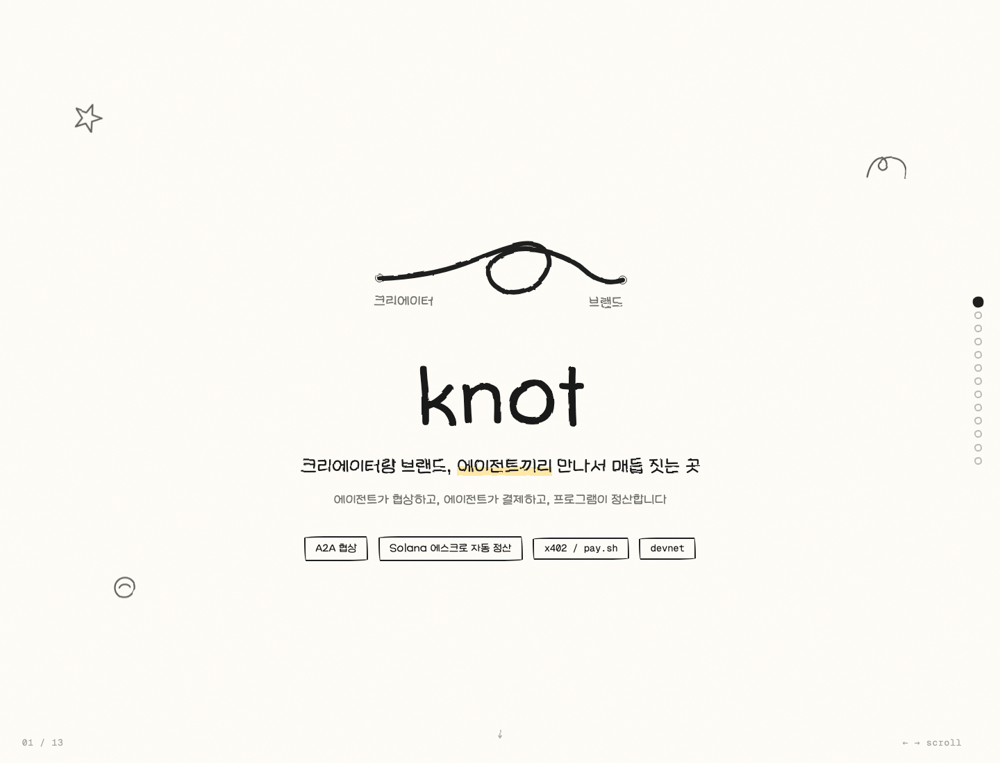
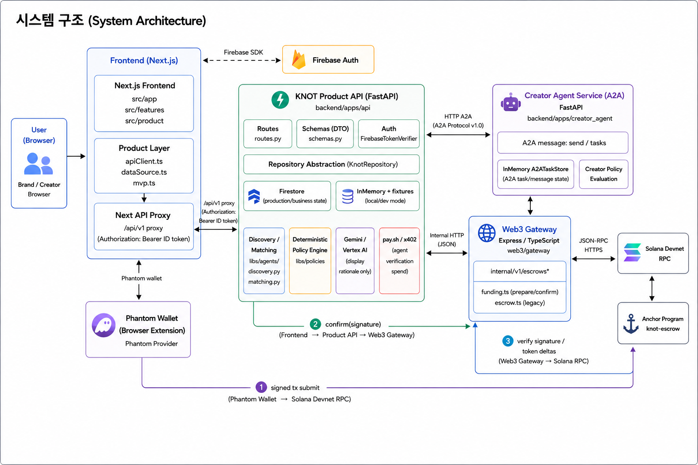
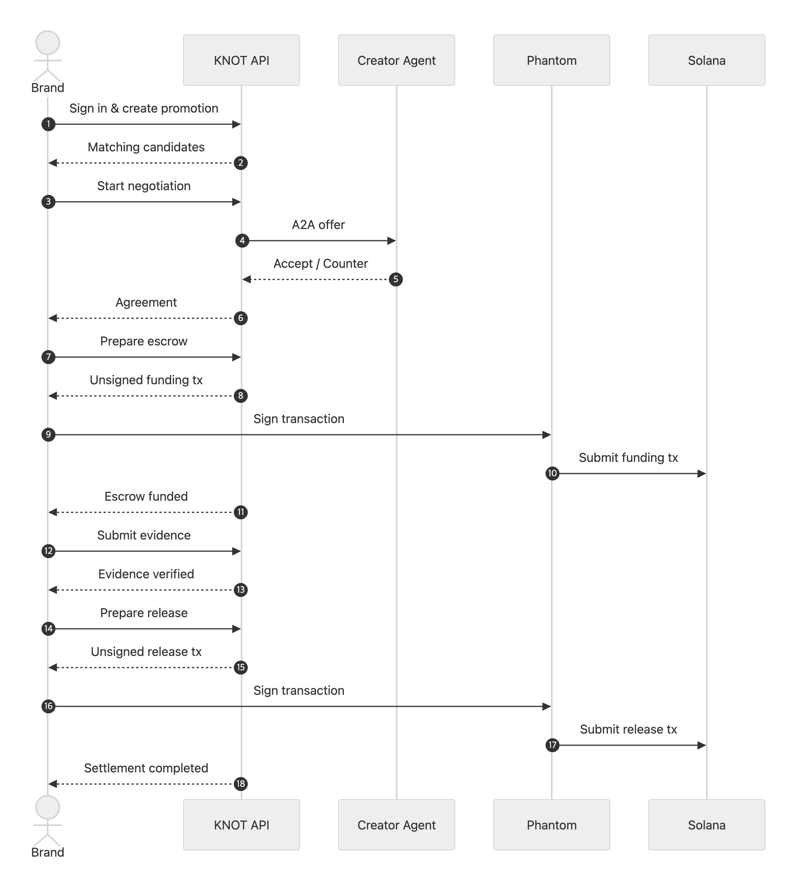

# KNOT

> Agents negotiate. Creators create. Solana settles.

KNOT은 AI 에이전트가 브랜드와 크리에이터의 협찬 조건을 대신 협상하고, 약속한 콘텐츠가 게시되면 Solana USDC 에스크로에서 대금을 자동 정산하는 서비스입니다.

## What KNOT Does

KNOT은 크리에이터 협찬을 DM, 스프레드시트, 수동 송금이 아니라 에이전트가 실행할 수 있는 거래로 바꿉니다.

1. 브랜드가 제품 URL, 작업 조건, 예산 한도를 입력합니다.
2. Brand Agent가 Creator 후보를 찾고 필요한 검증을 수행합니다.
3. Brand Agent와 Creator Agent가 HTTP A2A 메시지로 가격, 납기, 작업 범위를 협상합니다.
4. 합의가 생성되면 브랜드가 Phantom으로 USDC를 에스크로에 예치합니다.
5. 크리에이터가 콘텐츠 URL을 제출합니다.
6. evidence 검증이 통과하면 정산 권한이 마일스톤을 릴리즈하고 Creator 지갑으로 USDC를 지급합니다.

핵심은 "AI가 추천한다"가 아니라 "AI 에이전트가 사람의 서비스를 계약하고, 검증하고, 정산한다"입니다.

## Product Screens

## Architecture

KNOT은 UI와 에이전트 런타임, 결제 레일을 분리합니다. Firebase Auth가 사용자 신원을 담당하고, Firestore가 비즈니스 상태를 저장합니다. A2A 협상은 HTTP 경계를 건너며, Web3 Gateway는 Solana 트랜잭션 생성과 온체인 검증을 담당합니다.

## Transaction Flow

Creator 보상 에스크로와 Agent 운영 결제는 서로 다른 레일입니다.

| Rail | Purpose | Source of Funds | Recipient |
|---|---|---|---|
| Creator Compensation Escrow | 협찬 보상 예치와 마일스톤 정산 | Brand Phantom USDC ATA | Creator Phantom USDC ATA |
| pay.sh / x402 | Brand Agent의 외부 유료 검증 API 호출 | Agent operational payment wallet | Paid API provider |

Creator 보상에는 pay.sh를 사용하지 않습니다. pay.sh는 에이전트가 외부 API를 구매할 때만 사용됩니다.

## Why On-chain

크리에이터 협찬은 단순 구매가 아니라 조건부 이행 거래입니다.

- 브랜드는 결과물이 나오기 전 전체 금액을 바로 지급하고 싶지 않습니다.
- 크리에이터는 작업 완료 후 대금이 지연되는 것을 원하지 않습니다.
- 양쪽 모두 가격, 납기, 사용권, 산출물 조건을 합의해야 합니다.

KNOT은 합의 금액을 USDC 에스크로에 잠그고, evidence 검증 후 마일스톤 단위로 정산합니다. 협상 메시지와 프로필은 오프체인에 저장하고, 자금 이동과 최종 증명만 온체인에 둡니다.

AI 에이전트는 법인이 아니기 때문에 은행 계좌나 카드를 직접 만들 수 없습니다. 에이전트가 유료 검증 API를 사고, 합의된 보상을 조건부로 지급하려면 프로그램이 통제할 수 있는 지갑과 자산이 필요합니다. KNOT이 Solana를 쓰는 이유는 web3라는 이름 때문이 아니라, 에이전트가 사람의 서비스를 계약하고 정산할 수 있는 실행 레이어가 필요하기 때문입니다.

온체인에서 맡는 일은 세 가지로 제한합니다.

| Layer | Why it exists |
|---|---|
| Agreement hash | A2A 협상 결과를 나중에 바꿔 말할 수 없게 만듭니다. |
| USDC escrow | Brand 자금을 조건부로 잠그고, 검증 통과 후 Creator에게 지급합니다. |
| Transaction proof | funding / release signature로 실제 자금 이동을 확인합니다. |

Solana는 소액·고빈도 결제에 필요한 낮은 수수료와 빠른 확정을 제공합니다. USDC는 협상 금액과 정산 금액이 변동하지 않게 해 자동 정산을 가능하게 만듭니다.

## Stack

| Layer | Stack |
|---|---|
| Frontend | Next.js, TypeScript, Phantom provider |
| Auth | Firebase Auth |
| API | FastAPI, Firestore Native |
| Agent Runtime | Brand Agent, Creator Agent, HTTP A2A |
| AI | Gemini / Vertex AI for analysis and verification rationale |
| Agent Payment | pay.sh / x402 |
| Web3 | Solana, Anchor, USDC, Web3 Gateway |
| Deployment | Google Cloud Run |
