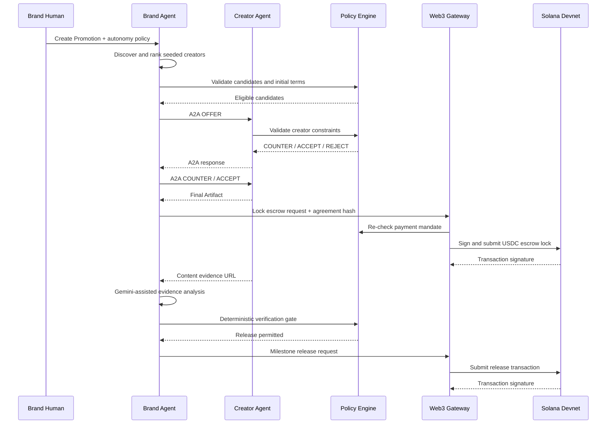

# KNOT Product Requirements Document v1

**Product:** KNOT — Brand × Creator Agentic Promotion Platform  
**Target:** Google Cloud × Solana AI Agentic Hackathon  
**Document version:** v1  
**Status:** Development baseline  
**Updated:** 2026-07-24

## 1. One-line definition

KNOT is a platform where a Brand Agent discovers and matches creators, negotiates with each Creator Agent through A2A within human-defined limits, finalizes a structured agreement, and autonomously locks and releases USDC through a Solana escrow.

## 2. Product thesis

Existing creator marketing workflows depend on manual search, DMs, spreadsheets, contract edits, and bank transfers. KNOT replaces the transaction workflow with bounded agents and an auditable settlement rail.

The product must visibly prove two things:

1. Two agents can discover, negotiate, and produce a structured agreement without continuous human operation.
2. The agent can move value without a click at transaction time, but only after deterministic policy checks.

## 3. Actors

| Actor | v1 responsibility |
|---|---|
| Brand Human | Creates a Promotion and sets budget, content, safety, rights, schedule, and autonomy limits |
| Brand Agent | Matches creators, initiates offers, evaluates counters, accepts/rejects, requests escrow actions |
| Creator Human | Uses a pre-seeded creator profile, rate card, restrictions, schedule, and wallet |
| Creator Agent | Evaluates offers and returns counter, accept, reject, or escalation decisions |
| KNOT Platform | Hosts agents, A2A routing, structured terms, policies, audit data, verification and transaction records |
| Web3 Gateway | Enforces payment authorization and executes Solana devnet transactions |

## 4. v1 end-to-end journey

## 5. Functional requirements

### FR-1 Promotion management

The Brand Human can create and view a Promotion with:

- title, objective, category and target audience
- total budget and per-creator ceiling
- requested deliverables and posting window
- usage-rights preset
- required disclosures and prohibited claims
- maximum negotiation rounds and autonomy settings

### FR-2 Agent-led creator matching

The Brand Agent must:

- retrieve seeded creator profiles and AgentCard metadata
- apply hard eligibility filters
- calculate a deterministic ranking score
- use Gemini only to generate a concise explanation, not the score itself
- persist candidates, scores, reasons, policy result, and selected creator

### FR-3 A2A negotiation

The system must support:

- official A2A v1.0 HTTP+JSON binding
- `OFFER`, `COUNTER`, `ACCEPT`, `REJECT`, `ESCALATE` domain messages in `Part.data`
- a maximum of five negotiation rounds
- real-time task/event updates
- final agreement or rejection Artifact
- idempotency by `messageId`

### FR-4 Structured agreement

The final agreement must contain machine-readable terms and a deterministic hash. Natural-language rationale is display-only and cannot affect payment.

### FR-5 Autonomous escrow lock

After agreement and policy validation, the Brand Agent can request an escrow lock without a new human approval at transaction time. The gateway records intent, policy snapshot hash, transaction signature, and status.

### FR-6 Evidence verification

The Creator side submits a content URL. The Brand Agent produces structured observations for required brand mention, required advertising disclosure, prohibited claims, and availability. Deterministic rules decide pass/fail.

### FR-7 Milestone release

A passing milestone can trigger a partial USDC release. The sum of milestone percentages must equal 100. A release cannot exceed the locked amount or repeat an already released milestone.

### FR-8 Auditable user experience

The frontend must show:

- Agent Society Map: Brand Agent, candidate Creator Agents, active A2A relationship and payment services
- Promotion Timeline: matching, messages, decisions, agreement, escrow, evidence, release
- policy blocks and escalation reasons
- Solana transaction signatures and explorer links

## 6. Canonical v1 terms

- Usage rights: `organicOnly`, `paidBoost30d`, `fullLicense90d`
- Compensation: `flat`, `basePlusPerformance`
- Negotiation round limit: 5
- Content revision limit: 1
- Settlement network: Solana devnet
- Settlement asset: devnet USDC-compatible mint configured by environment

## 7. Non-functional requirements

- Every cloud workload runs on Google Cloud.
- Services are independently deployable Cloud Run containers.
- No long-lived Google service-account key files.
- Private keys never enter Gemini prompts or application logs.
- All agent decisions and payment actions have correlation IDs and audit records.
- The demo path must be reproducible from a documented seed command.
- Cloud Run services must expose health and readiness endpoints.

## 8. Success metrics for the hackathon build

| Metric | Target |
|---|---|
| Full Promotion-to-escrow demo | completes without manual DB edits |
| Negotiation | at least one counter round and final Artifact |
| Bounded autonomy | at least one policy-violation action visibly blocked |
| On-chain proof | escrow lock and release signatures visible |
| GCP proof | live Cloud Run URLs, Firestore data, Vertex AI logs/telemetry |
| Reproducibility | clean setup and demo run documented in README |

## 9. Official schedule alignment

- Build/submission deadline: 2026-08-03 23:59 KST
- Finalist announcement: 2026-08-07
- Finalist mentoring: 2026-08-10 through 2026-08-20
- Offline Demo Day: 2026-08-21

## 10. Explicit exclusions

See `02_SCOPE_GLOSSARY.md`. Onboarding logic, mainnet, fiat rails, generalized dispute resolution and production custody are not part of v1.
