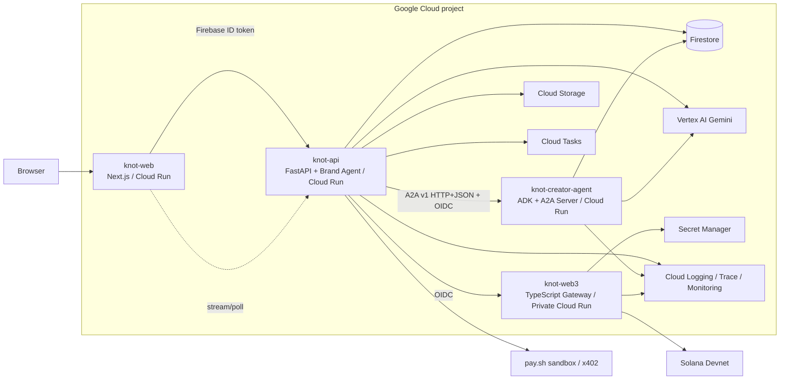

# KNOT v1 System Architecture

## 1. Architecture goals

- Demonstrate genuine A2A communication across Cloud Run services.
- Keep service count small enough for the hackathon.
- Separate LLM reasoning, deterministic policy, and transaction signing.
- Make every critical state transition observable and replayable.

## 2. Runtime services



## 3. Service responsibilities

### `knot-web`

- Promotion form and dashboard
- Agent Society Map
- Promotion Timeline and A2A event view
- Evidence submission
- Firebase Authentication client
- No direct Firestore writes for business data
- No Solana private key or privileged RPC action

### `knot-api`

- Product REST API
- Brand Agent and creator matching
- promotion, matching, negotiation, agreement and verification orchestration
- A2A client
- deterministic Policy Engine
- Firestore repositories
- audit-event emission
- authenticated invocation of creator-agent and web3 services

### `knot-creator-agent`

- official A2A v1 AgentCard and endpoints
- tenant routing by `creatorAgentId`
- Creator Agent context assembly
- Gemini structured decision generation
- Creator policy validation
- Task, Message, Event and Artifact persistence

### `knot-web3`

- validates signed/authenticated payment request from `knot-api`
- reloads agreement and policy snapshot from Firestore or validates supplied hashes
- retrieves demo signer secret from Secret Manager
- builds and sends Solana devnet transactions
- prevents duplicate lock/release through idempotency keys
- returns normalized receipt and explorer URL

## 4. Synchronous and asynchronous work

- User-facing commands create a Firestore task record first.
- Short operations may complete synchronously.
- Matching, evidence verification and retries may run through Cloud Tasks.
- Never rely on a detached in-process background task after returning an HTTP response from Cloud Run.
- UI consumes persisted events by polling or server-sent events. Firestore remains the source of truth.

## 5. Trust boundaries

```text
Browser
  -> Firebase identity
knot-api
  -> owns business authorization and Brand policy
creator-agent
  -> owns Creator policy and A2A task execution
web3 gateway
  -> owns signing and transaction invariants
Solana program
  -> owns escrow balance and release invariants
```

Gemini is outside every authorization boundary. Its output is always untrusted structured input until validated.

## 6. Deployment topology

- One GCP project for the hackathon environment.
- Primary region: `us-central1` for service compatibility and consistency with Google examples.
- Public services: `knot-web`; `knot-api` only where required.
- Private IAM-authenticated services: `knot-creator-agent`, `knot-web3`.
- Backend minimum instances may be set to 1 during the demo window to reduce cold starts; default may scale to zero outside the demo.
