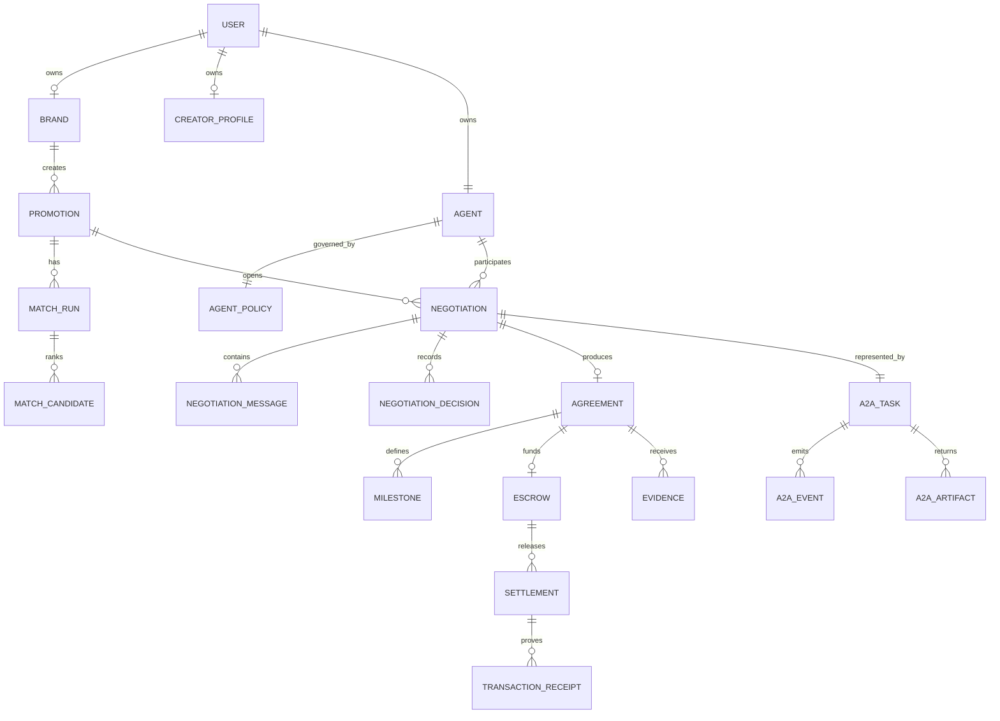

# KNOT v2 Data Model

## 1. 원칙

- 기존 canonical collection을 유지한다.
- UI 편의를 위해 canonical data를 중복 생성하지 않는다.
- 필요한 경우 sanitized read model/cache만 additive하게 추가한다.
- 모든 write는 Product API를 통한다.
- ownerId, role, status, termsHash, idempotency를 불변조건으로 관리한다.

---

## 2. 관계



---

## 3. Collections

```text
users/{userId}
brands/{brandId}
creatorProfiles/{creatorId}
agents/{agentId}
agentPolicies/{agentId}

promotions/{promotionId}
promotions/{promotionId}/events/{eventId}

matchRuns/{matchRunId}
matchRuns/{matchRunId}/candidates/{creatorId}

negotiations/{negotiationId}
negotiations/{negotiationId}/messages/{messageId}
negotiations/{negotiationId}/decisions/{decisionId}

a2aTasks/{taskId}
a2aTasks/{taskId}/events/{eventId}
a2aTasks/{taskId}/artifacts/{artifactId}

agreements/{agreementId}
agreements/{agreementId}/milestones/{milestoneId}

evidence/{evidenceId}
escrows/{escrowId}
settlements/{settlementId}
paymentOperations/{operationId}
transactionReceipts/{receiptId}
auditEvents/{eventId}
idempotencyRecords/{key}
```

---

## 4. User

```json
{
  "userId": "firebase-uid",
  "email": "user@example.com",
  "role": "BRAND",
  "displayName": "Glow",
  "onboardingVersion": 2,
  "onboardingStep": "COMPLETE",
  "onboardingCompleted": true,
  "createdAt": "timestamp",
  "updatedAt": "timestamp"
}
```

---

## 5. Brand

```json
{
  "brandId": "brand-001",
  "ownerId": "firebase-uid",
  "name": "Glow",
  "sourceUrl": "https://...",
  "sourceSnapshot": {
    "productName": "Daily SPF Moisturizer",
    "priceKrw": 28000,
    "category": "beauty",
    "description": "...",
    "imageUrl": "..."
  },
  "createdAt": "timestamp",
  "updatedAt": "timestamp"
}
```

---

## 6. Creator Profile

```json
{
  "creatorId": "creator-001",
  "ownerId": "firebase-uid",
  "displayName": "Mina",
  "instagramHandle": "demobeauty",
  "socialSourceUrl": "https://instagram.com/demobeauty",
  "socialSnapshot": {
    "collectedAt": "timestamp",
    "followerCount": 57922,
    "averageViews": 98467,
    "engagementRate": 2.8,
    "reelsRatio": 65,
    "source": "REAL"
  },
  "styleTags": ["차분한 설명", "성분 중심", "루틴 공유"],
  "profileImageUrl": "...",
  "createdAt": "timestamp",
  "updatedAt": "timestamp"
}
```

`source`:
- `REAL`
- `USER_CONFIRMED`
- `DEMO`

API mode에서 `DEMO`를 실제 값처럼 표시하지 않는다.

---

## 7. Agent

```json
{
  "agentId": "creator-agent-001",
  "ownerId": "firebase-uid",
  "agentType": "CREATOR",
  "displayName": "Mina Agent",
  "avatarKey": "mina",
  "status": "ACTIVE",
  "availability": "OFFLINE",
  "acceptingOffers": false,
  "profileRef": "creatorProfiles/creator-001",
  "policyRef": "agentPolicies/creator-agent-001",
  "connectedAt": "timestamp",
  "lastActivatedAt": "timestamp",
  "agentVersion": "2.0.0",
  "promptVersion": "creator-negotiator-v2"
}
```

---

## 8. Agent Policy

Creator:

```json
{
  "agentId": "creator-agent-001",
  "policyType": "CREATOR",
  "minimumBaseUsdc": 300,
  "blockedCategories": [
    "gambling",
    "high_risk_finance",
    "diet_supplement"
  ],
  "approvalRules": {},
  "updatedAt": "timestamp"
}
```

Brand:

```json
{
  "agentId": "brand-agent-001",
  "policyType": "BRAND",
  "totalBudgetUsdc": 2000,
  "perDealCapUsdc": 800,
  "approvalRules": {
    "usageRightsRequiresApproval": true
  },
  "updatedAt": "timestamp"
}
```

상대에게 policy snapshot 전체를 반환하지 않는다.

---

## 9. Promotion

```json
{
  "promotionId": "promotion-001",
  "brandId": "brand-001",
  "brandAgentId": "brand-agent-001",
  "status": "DRAFT",
  "title": "Daily SPF Promotion",
  "sourceUrl": "...",
  "productSnapshot": {},
  "moodTags": ["설명형", "정보", "루틴"],
  "deliverables": [
    { "format": "REEL", "count": 1 }
  ],
  "usageRights": "ORGANIC_ONLY",
  "deadline": "timestamp",
  "totalBudgetUsdc": 2000,
  "perDealCapUsdc": 800,
  "milestoneTemplate": [
    { "code": "AGREEMENT", "percentage": 30 },
    { "code": "POST_VERIFIED", "percentage": 70 }
  ],
  "createdAt": "timestamp",
  "updatedAt": "timestamp"
}
```

---

## 10. Negotiation

```json
{
  "negotiationId": "neg-001",
  "promotionId": "promotion-001",
  "brandAgentId": "brand-agent-001",
  "creatorAgentId": "creator-agent-001",
  "contextId": "ctx-001",
  "taskId": "task-001",
  "status": "COUNTERED",
  "currentRound": 2,
  "maxRounds": 5,
  "currentTerms": {
    "baseAmountUsdc": 300,
    "deliverables": [
      { "format": "REEL", "count": 1 }
    ]
  },
  "brandPolicySnapshotRef": "private/...",
  "creatorPolicySnapshotRef": "private/...",
  "lastMessageId": "msg-002",
  "createdAt": "timestamp",
  "updatedAt": "timestamp"
}
```

---

## 11. Agreement

```json
{
  "agreementId": "agr-001",
  "negotiationId": "neg-001",
  "promotionId": "promotion-001",
  "brandId": "brand-001",
  "creatorId": "creator-001",
  "status": "FINALIZED",
  "terms": {
    "baseAmountUsdc": 300,
    "deliverables": [
      { "format": "REEL", "count": 1 }
    ],
    "usageRights": "ORGANIC_ONLY",
    "deadline": "timestamp",
    "milestones": [
      { "code": "AGREEMENT", "percentage": 30 },
      { "code": "POST_VERIFIED", "percentage": 70 }
    ]
  },
  "termsHash": "sha256:...",
  "artifactId": "artifact-001",
  "createdAt": "timestamp"
}
```

Canonical JSON serialization 규칙을 고정해야 한다.

---

## 12. Escrow

```json
{
  "escrowId": "escrow-001",
  "agreementId": "agr-001",
  "status": "CONFIRMED",
  "network": "SOLANA_DEVNET",
  "asset": "USDC",
  "mint": "...",
  "amountBaseUnits": "300000000",
  "brandWallet": "...",
  "creatorWallet": "...",
  "termsHash": "sha256:...",
  "lockReceiptId": "receipt-lock-001",
  "lockedAt": "timestamp",
  "releasedBaseUnits": "0"
}
```

---

## 13. Evidence

```json
{
  "evidenceId": "evidence-001",
  "agreementId": "agr-001",
  "creatorId": "creator-001",
  "type": "INSTAGRAM_URL",
  "url": "https://instagram.com/reel/...",
  "status": "SUBMITTED",
  "observations": {},
  "verificationDecision": null,
  "createdAt": "timestamp",
  "updatedAt": "timestamp"
}
```

---

## 14. Settlement / Receipt

```json
{
  "settlementId": "settle-001",
  "escrowId": "escrow-001",
  "agreementId": "agr-001",
  "milestoneId": "POST_VERIFIED",
  "amountBaseUnits": "210000000",
  "status": "CONFIRMED",
  "receiptId": "receipt-release-001",
  "createdAt": "timestamp"
}
```

```json
{
  "receiptId": "receipt-release-001",
  "operationType": "ESCROW_RELEASE",
  "network": "SOLANA_DEVNET",
  "signature": "...",
  "explorerUrl": "...",
  "status": "CONFIRMED",
  "submittedAt": "timestamp",
  "confirmedAt": "timestamp"
}
```

---

## 15. Idempotency

Key examples:

```text
agreement:{negotiationId}
escrow-lock:{agreementId}
milestone-release:{agreementId}:{milestoneId}
evidence:{agreementId}:{normalizedUrl}
a2a-message:{messageId}
```

모든 operation은 같은 key로 재시도했을 때 동일 결과를 반환한다.

---

## 16. Indexes

권장:

```text
negotiations:
  brandAgentId + updatedAt desc
  creatorAgentId + updatedAt desc
  promotionId + status + updatedAt desc

agreements:
  brandId + createdAt desc
  creatorId + createdAt desc

escrows:
  agreementId unique
  status + updatedAt desc

settlements:
  creatorId + status + createdAt desc

agents:
  agentType + acceptingOffers + availability
```

실제 Firestore composite index는 query 코드와 함께 관리한다.
