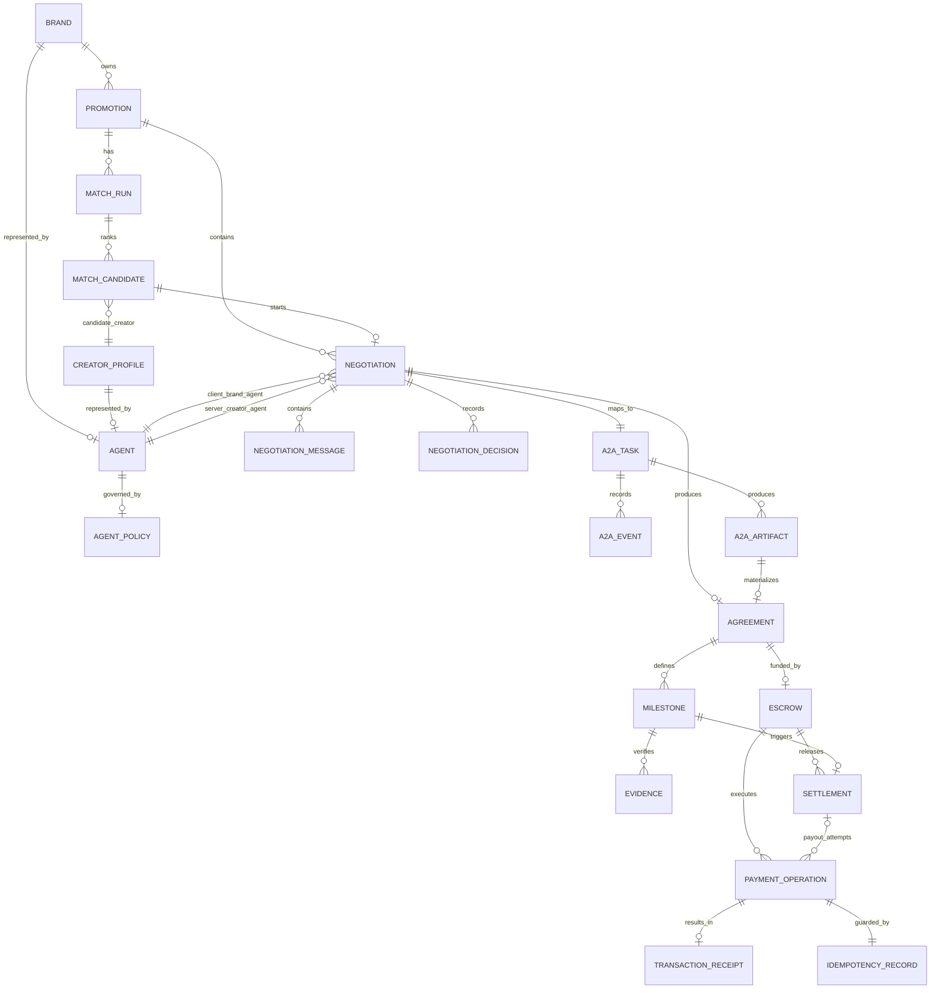

# Domain and Firestore Data Model

## 1. Core entities



This ERD is a logical relationship map. Firestore is not relational; actual
documents store document ID references such as `promotionId`, `creatorId`,
`creatorAgentId`, `matchRunId`, `taskId`, `artifactId`, `agreementId`,
`milestoneId`, `paymentOperationId`, and immutable snapshot fields where policy
or payment decisions must remain replayable.

## 2. Collections

```text
users/{userId}
brands/{brandId}
creatorProfiles/{creatorId}
agents/{agentId}
agentPolicies/{agentId}
promotions/{promotionId}
promotions/{promotionId}/events/{eventId}
matchRuns/{matchRunId}
matchRuns/{matchRunId}/candidates/{creatorId}
negotiations/{negotiationId}
negotiations/{negotiationId}/messages/{messageId}
negotiations/{negotiationId}/decisions/{decisionId}
a2aTasks/{taskId}
a2aTasks/{taskId}/events/{eventId}
a2aTasks/{taskId}/artifacts/{artifactId}
agreements/{agreementId}
agreements/{agreementId}/milestones/{milestoneId}
evidence/{evidenceId}
escrows/{escrowId}
settlements/{settlementId}
paymentOperations/{operationId}
transactionReceipts/{receiptId}
auditEvents/{eventId}
idempotencyRecords/{key}
```

`users/{userId}` is an application account context document for the current
product build. It stores local-demo/Firebase identity projection fields such as
`email`, `displayName`, `roles`, `activeRole`, and role context references
(`brandId`, `brandAgentId`, `creatorId`, `creatorAgentId`). It does not store
passwords, tokens, private keys, seed phrases, or payment authority.

## 3. Promotion

```json
{
  "promotionId": "uuid",
  "brandId": "brand-001",
  "brandAgentId": "brand-agent-001",
  "title": "Summer skincare launch",
  "objective": "awareness",
  "category": "beauty",
  "targetAudience": ["20s", "skincare"],
  "budget": {
    "totalUsdc": 2000,
    "maxPerCreatorUsdc": 800
  },
  "deliverables": [{"format": "reel", "count": 1}],
  "postingWindow": {"start": "2026-07-30", "end": "2026-08-10"},
  "usageRights": "paidBoost30d",
  "constraints": {
    "requiredDisclosures": ["광고"],
    "prohibitedClaims": [],
    "requiredCategories": ["beauty"]
  },
  "autonomy": {
    "maxNegotiationRounds": 5,
    "autoEscrow": true,
    "autoRelease": true
  },
  "status": "DRAFT",
  "createdAt": "timestamp",
  "updatedAt": "timestamp"
}
```

## 4. Agent policy

```json
{
  "agentId": "creator-agent-001",
  "policyVersion": 1,
  "agentType": "CREATOR",
  "creator": {
    "minBaseUsdc": 300,
    "blockedIndustries": ["gambling", "cryptoTrading"],
    "maxDeliverablesPerMonth": 4,
    "minDaysToPost": 5,
    "allowedUsageRights": ["organicOnly", "paidBoost30d"]
  },
  "active": true,
  "createdAt": "timestamp"
}
```

## 5. Match run

```json
{
  "matchRunId": "uuid",
  "promotionId": "uuid",
  "brandAgentId": "brand-agent-001",
  "status": "COMPLETED",
  "weightsVersion": "matching-v1",
  "selectedCreatorId": "creator-001",
  "selectedCreatorAgentId": "creator-agent-001",
  "createdAt": "timestamp",
  "completedAt": "timestamp"
}
```

Candidate document:

```json
{
  "creatorId": "creator-001",
  "creatorAgentId": "creator-agent-001",
  "creatorProfilePath": "creatorProfiles/creator-001",
  "eligible": true,
  "score": 0.87,
  "componentScores": {
    "category": 1.0,
    "budget": 0.9,
    "schedule": 0.8,
    "deliverable": 1.0,
    "reputation": 0.6
  },
  "hardFilterReasons": [],
  "explanation": "Category, rate and schedule fit the Promotion.",
  "rank": 1,
  "negotiationId": null
}
```

## 6. Negotiation

```json
{
  "negotiationId": "uuid",
  "matchRunId": "uuid",
  "matchCandidateId": "creator-001",
  "matchCandidatePath": "matchRuns/{matchRunId}/candidates/creator-001",
  "promotionId": "uuid",
  "brandAgentId": "brand-agent-001",
  "creatorAgentId": "creator-agent-001",
  "contextId": "uuid",
  "taskId": "uuid",
  "status": "COUNTERED",
  "currentRound": 2,
  "maxRounds": 5,
  "currentTerms": {},
  "brandPolicySnapshot": {},
  "creatorPolicySnapshot": {},
  "lastMessageId": "uuid",
  "createdAt": "timestamp",
  "updatedAt": "timestamp"
}
```

## 7. Agreement

```json
{
  "agreementId": "uuid",
  "negotiationId": "uuid",
  "taskId": "uuid",
  "artifactId": "uuid",
  "promotionId": "uuid",
  "brandAgentId": "brand-agent-001",
  "creatorAgentId": "creator-agent-001",
  "terms": {
    "compensation": {
      "structure": "flat",
      "baseAmountUsdc": 650,
      "performancePct": 0
    },
    "deliverables": [{
      "format": "reel",
      "count": 1,
      "postWindow": {"start": "2026-08-05", "end": "2026-08-10"},
      "revisionRounds": 1
    }],
    "usageRights": "organicOnly",
    "milestones": [
      {"id": "contract", "trigger": "contractSigned", "releasePct": 30},
      {"id": "content", "trigger": "contentLiveVerified", "releasePct": 70}
    ],
    "constraints": {
      "requiredDisclosures": ["광고"],
      "prohibitedClaims": [],
      "exclusivityDays": 0
    }
  },
  "canonicalTermsJson": "...",
  "termsHash": "sha256:...",
  "status": "AGREED",
  "createdAt": "timestamp"
}
```

Milestone document:

```json
{
  "milestoneId": "content",
  "agreementId": "uuid",
  "trigger": "contentLiveVerified",
  "releasePct": 70,
  "status": "PENDING",
  "createdAt": "timestamp"
}
```

## 8. Evidence

```json
{
  "evidenceId": "uuid",
  "agreementId": "uuid",
  "milestoneId": "content",
  "milestonePath": "agreements/{agreementId}/milestones/content",
  "milestoneSnapshot": {},
  "promotionId": "uuid",
  "creatorAgentId": "creator-agent-001",
  "submittedByAgentId": "creator-agent-001",
  "url": "https://social.example/post/123",
  "status": "PASSED",
  "observations": {
    "urlReachable": true,
    "brandMentioned": true,
    "disclosurePresent": true,
    "prohibitedClaimsFound": []
  },
  "policyDecision": {
    "allowed": true,
    "ruleVersion": "verification-v1"
  },
  "createdAt": "timestamp",
  "updatedAt": "timestamp",
  "verifiedAt": "timestamp"
}
```

## 9. Escrow, settlement and payment operation

Escrow:

```json
{
  "escrowId": "uuid",
  "agreementId": "uuid",
  "network": "solanaDevnet",
  "programId": "...",
  "escrowPda": "...",
  "mint": "...",
  "lockedAmountBaseUnits": "650000000",
  "termsHash": "sha256:...",
  "status": "LOCKED",
  "lockSignature": "...",
  "createdAt": "timestamp"
}
```

Settlement:

```json
{
  "settlementId": "uuid",
  "escrowId": "uuid",
  "agreementId": "uuid",
  "milestoneId": "content",
  "amountBaseUnits": "455000000",
  "status": "CONFIRMED",
  "createdAt": "timestamp"
}
```

Payment operation:

```json
{
  "operationId": "uuid",
  "operationType": "ESCROW_LOCK",
  "escrowId": "uuid",
  "settlementId": null,
  "agreementId": "uuid",
  "milestoneId": null,
  "idempotencyKey": "lock:<agreementId>",
  "idempotencyRecordPath": "idempotencyRecords/lock:<agreementId>",
  "status": "CONFIRMED",
  "createdAt": "timestamp",
  "updatedAt": "timestamp"
}
```

Transaction receipt:

```json
{
  "receiptId": "uuid",
  "paymentOperationId": "uuid",
  "network": "solanaDevnet",
  "signature": "...",
  "explorerUrl": "...",
  "status": "CONFIRMED",
  "createdAt": "timestamp"
}
```

Idempotency record:

```json
{
  "key": "lock:<agreementId>",
  "payloadHash": "sha256:...",
  "ownerPath": "paymentOperations/{operationId}",
  "createdAt": "timestamp"
}
```

## 10. Event boundaries

`promotions/{promotionId}/events/{eventId}` is product timeline data for the
frontend. It records user-visible milestones in a Promotion flow.

`auditEvents/{eventId}` is append-only operational/security audit data. It may
reference a Promotion, Agreement, PaymentOperation or service request, but the UI
must not depend on it as the timeline source.

## 11. Invariants

1. Agreement milestone percentages sum to exactly 100.
2. `currentRound` increments once per accepted unique message.
3. Terminal negotiations accept no new messages.
4. Agreement hash is generated from canonical JSON with display-only fields removed.
5. Escrow lock amount equals the payable fixed amount for v1.
6. Released amount never exceeds locked amount.
7. One milestone can be released once.
8. Every payment action creates one PaymentOperation guarded by one IdempotencyRecord.
9. Policy snapshots are immutable after negotiation starts.
10. Audit events are append-only.
