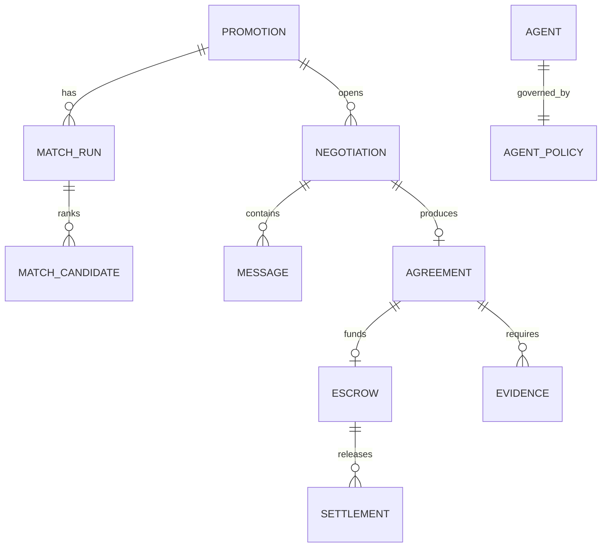

# Domain and Firestore Data Model

## 1. Core entities



## 2. Collections

```text
brands/{brandId}
creatorProfiles/{creatorId}
agents/{agentId}
agentPolicies/{agentId}
promotions/{promotionId}
promotions/{promotionId}/events/{eventId}
matchRuns/{matchRunId}
matchRuns/{matchRunId}/candidates/{creatorAgentId}
negotiations/{negotiationId}
negotiations/{negotiationId}/messages/{messageId}
negotiations/{negotiationId}/decisions/{decisionId}
a2aTasks/{taskId}
a2aTasks/{taskId}/events/{eventId}
a2aTasks/{taskId}/artifacts/{artifactId}
agreements/{agreementId}
evidence/{evidenceId}
escrows/{escrowId}
settlements/{settlementId}
transactionReceipts/{receiptId}
auditEvents/{eventId}
idempotencyKeys/{key}
```

## 3. Promotion

```json
{
  "promotionId": "uuid",
  "brandId": "brand-001",
  "brandAgentId": "brand-agent-001",
  "title": "Summer skincare launch",
  "objective": "awareness",
  "category": "beauty",
  "targetAudience": ["20s", "skincare"],
  "budget": {
    "totalUsdc": 2000,
    "maxPerCreatorUsdc": 800
  },
  "deliverables": [{"format": "reel", "count": 1}],
  "postingWindow": {"start": "2026-07-30", "end": "2026-08-10"},
  "usageRights": "paidBoost30d",
  "constraints": {
    "requiredDisclosures": ["광고"],
    "prohibitedClaims": [],
    "requiredCategories": ["beauty"]
  },
  "autonomy": {
    "maxNegotiationRounds": 5,
    "autoEscrow": true,
    "autoRelease": true
  },
  "status": "DRAFT",
  "createdAt": "timestamp",
  "updatedAt": "timestamp"
}
```

## 4. Agent policy

```json
{
  "agentId": "creator-agent-001",
  "policyVersion": 1,
  "agentType": "CREATOR",
  "creator": {
    "minBaseUsdc": 300,
    "blockedIndustries": ["gambling", "cryptoTrading"],
    "maxDeliverablesPerMonth": 4,
    "minDaysToPost": 5,
    "allowedUsageRights": ["organicOnly", "paidBoost30d"]
  },
  "active": true,
  "createdAt": "timestamp"
}
```

## 5. Match run

```json
{
  "matchRunId": "uuid",
  "promotionId": "uuid",
  "brandAgentId": "brand-agent-001",
  "status": "COMPLETED",
  "weightsVersion": "matching-v1",
  "selectedCreatorAgentId": "creator-agent-001",
  "createdAt": "timestamp",
  "completedAt": "timestamp"
}
```

Candidate document:

```json
{
  "creatorAgentId": "creator-agent-001",
  "eligible": true,
  "score": 0.87,
  "componentScores": {
    "category": 1.0,
    "budget": 0.9,
    "schedule": 0.8,
    "deliverable": 1.0,
    "reputation": 0.6
  },
  "hardFilterReasons": [],
  "explanation": "Category, rate and schedule fit the Promotion.",
  "rank": 1
}
```

## 6. Negotiation

```json
{
  "negotiationId": "uuid",
  "promotionId": "uuid",
  "brandAgentId": "brand-agent-001",
  "creatorAgentId": "creator-agent-001",
  "contextId": "uuid",
  "taskId": "uuid",
  "status": "COUNTERED",
  "currentRound": 2,
  "maxRounds": 5,
  "currentTerms": {},
  "brandPolicySnapshot": {},
  "creatorPolicySnapshot": {},
  "lastMessageId": "uuid",
  "createdAt": "timestamp",
  "updatedAt": "timestamp"
}
```

## 7. Agreement

```json
{
  "agreementId": "uuid",
  "negotiationId": "uuid",
  "promotionId": "uuid",
  "brandAgentId": "brand-agent-001",
  "creatorAgentId": "creator-agent-001",
  "terms": {
    "compensation": {
      "structure": "flat",
      "baseAmountUsdc": 650,
      "performancePct": 0
    },
    "deliverables": [{
      "format": "reel",
      "count": 1,
      "postWindow": {"start": "2026-08-05", "end": "2026-08-10"},
      "revisionRounds": 1
    }],
    "usageRights": "organicOnly",
    "milestones": [
      {"id": "contract", "trigger": "contractSigned", "releasePct": 30},
      {"id": "content", "trigger": "contentLiveVerified", "releasePct": 70}
    ],
    "constraints": {
      "requiredDisclosures": ["광고"],
      "prohibitedClaims": [],
      "exclusivityDays": 0
    }
  },
  "canonicalTermsJson": "...",
  "termsHash": "sha256:...",
  "status": "AGREED",
  "createdAt": "timestamp"
}
```

## 8. Escrow and settlement

Escrow:

```json
{
  "escrowId": "uuid",
  "agreementId": "uuid",
  "network": "solanaDevnet",
  "programId": "...",
  "escrowPda": "...",
  "mint": "...",
  "lockedAmountBaseUnits": "650000000",
  "termsHash": "sha256:...",
  "status": "LOCKED",
  "lockSignature": "...",
  "createdAt": "timestamp"
}
```

Settlement:

```json
{
  "settlementId": "uuid",
  "escrowId": "uuid",
  "milestoneId": "content",
  "amountBaseUnits": "455000000",
  "status": "CONFIRMED",
  "signature": "...",
  "idempotencyKey": "release:<escrowId>:content",
  "createdAt": "timestamp"
}
```

## 9. Invariants

1. Agreement milestone percentages sum to exactly 100.
2. `currentRound` increments once per accepted unique message.
3. Terminal negotiations accept no new messages.
4. Agreement hash is generated from canonical JSON with display-only fields removed.
5. Escrow lock amount equals the payable fixed amount for v1.
6. Released amount never exceeds locked amount.
7. One milestone can be released once.
8. Every payment action has a unique idempotency key.
9. Policy snapshots are immutable after negotiation starts.
10. Audit events are append-only.
