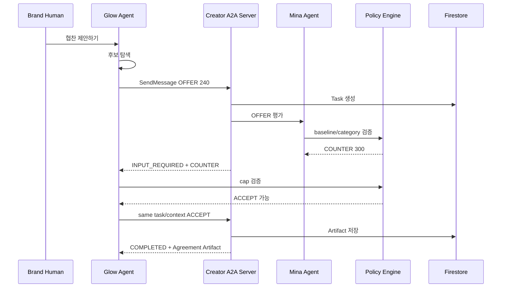

# A2A Agent Runtime

## 1. 범위

A2A 레이어:
- AgentCard
- capability discovery
- Message
- Task
- multi-turn
- streaming
- Artifact

Application:
- matching
- Gemini context
- policy validation
- Agreement
- Escrow
- Settlement

---

## 2. 역할

```text
Brand Agent
= Matching + A2A Client

Creator Agent
= A2A Server + Creator Runtime
```

MVP의 협상 Task에서는 Brand가 Client, Creator가 Server다.

---

## 3. AgentCard

Creator Agent는 다음 capability를 선언한다.

- sponsorship negotiation
- application/json
- streaming
- bearer service auth
- tenant routing if supported

```text
tenant = creatorAgentId
```

Agent Registry는:
- owner-approved public profile
- AgentCard metadata
- availability
- acceptingOffers
를 제공한다.

Private policy는 Registry에 노출하지 않는다.

---

## 4. Domain Message

```text
OFFER
COUNTER
ACCEPT
REJECT
ESCALATE
```

`Part.data`:

```json
{
  "schema": "knot.negotiation.v1",
  "type": "OFFER",
  "round": 1,
  "terms": {
    "baseAmountUsdc": 240,
    "deliverables": [
      { "format": "REEL", "count": 1 }
    ],
    "usageRights": "ORGANIC_ONLY",
    "deadline": "..."
  },
  "publicRationale": "릴스 1개로 시작해볼게요."
}
```

---

## 5. Golden Path



---

## 6. Policy

Creator:
1. blocked category
2. minimumBaseUsdc
3. optional advanced policy
4. user approval

Brand:
1. Promotion relevance
2. total remaining budget
3. perDealCapUsdc
4. rights/other approval rule

LLM은 structured proposal을 생성한다. 최종 decision은 deterministic policy가 한다.

---

## 7. Human Approval

A2A:
- `TASK_STATE_AUTH_REQUIRED` 또는 application-level ESCALATE

UI:
- `사용자 승인 필요`

Human:
- APPROVE
- MODIFY
- REJECT

같은 taskId/contextId로 재개한다.

---

## 8. Rejection

정상 비즈니스 불성립:
- Task COMPLETED
- Artifact result REJECTED

Agent가 요청 수행 자체를 거부:
- Task REJECTED

UI reason:
- category policy
- budget mismatch
- schedule unavailable
- max rounds
- user rejected

상대에게 sanitized reason만 반환한다.

---

## 9. Multiple Negotiations

- Promotion 하나에 여러 Negotiation
- 각 Negotiation은 독립 Task
- 같은 Creator와 중복 active Negotiation 방지
- List에서 status filter
- 상세는 한 pair

MVP animation은 선택된 한 대화에 집중한다.

---

## 10. Task State Mapping

| A2A | Domain | UI |
|---|---|---|
| SUBMITTED | OFFERED | 제안이 전달됐어요 |
| WORKING | OFFERED/COUNTERED | Agent가 검토 중 |
| INPUT_REQUIRED | COUNTERED | 상대 응답 대기 |
| AUTH_REQUIRED | ESCALATED | 사용자 승인 필요 |
| COMPLETED AGREED | AGREED | 협상 완료 |
| COMPLETED REJECTED | REJECTED | 협상 불성립 |
| FAILED | FAILED | 오류 |
| CANCELED | CANCELED | 취소 |
| REJECTED | REJECTED | 요청 거부 |

---

## 11. Persistence

- raw A2A Task/Event/Artifact
- domain Negotiation Message/Decision
- user activity projection

Message idempotency:
- duplicate messageId returns prior result

Terminal state:
- no new negotiation message after terminal
- retry creates explicit retry operation or new Task according to failure class

---

## 12. Streaming

Order:
- sequence monotonic
- duplicate removal
- terminal closes stream
- reconnect with last sequence
- fallback polling

Frontend:
- does not render raw payload
- calls `AgentActivityMapper`
- unsubscribes on route leave

---

## 13. User Timeline Projection

Canonical inputs:
- Messages
- Decisions
- Task state
- Artifact
- Agreement
- Escrow
- Evidence
- Settlement

Output:

```ts
type AgentActivityItem = {
  id: string;
  type:
    | "MANAGER_INTRO"
    | "CANDIDATES"
    | "INBOUND_OFFER"
    | "OFFER"
    | "COUNTER"
    | "POLICY_CHECK"
    | "APPROVAL_REQUIRED"
    | "ACCEPT"
    | "REJECT"
    | "AGREEMENT"
    | "ESCROW"
    | "EVIDENCE"
    | "MILESTONE"
    | "NEXT_ACTION";
  actor: "BRAND_AGENT" | "CREATOR_AGENT" | "SYSTEM";
  actorName: string;
  message: string;
  amountUsdc?: number;
  status: "WAITING" | "ACTIVE" | "DONE" | "BLOCKED" | "FAILED";
  occurredAt?: string;
};
```

---

## 14. Privacy

Creator own view:
- baseline visible
- blocked categories visible

Brand own view:
- total budget/cap visible

Counterparty:
- exact private policy hidden
- outcome and public rationale only

Dev:
- raw IDs and payload behind authorization

---

## 15. Protocol Invariants

1. camelCase
2. official A2A enum strings
3. A2A version header
4. `application/a2a+json`
5. tenant only if declared
6. server creates initial taskId
7. same task/context for follow-up
8. Message role by Client/Server direction
9. final result in Artifact
10. Part has one content variant
11. stream order preserved
12. duplicate message detected
13. terminal Task immutable
