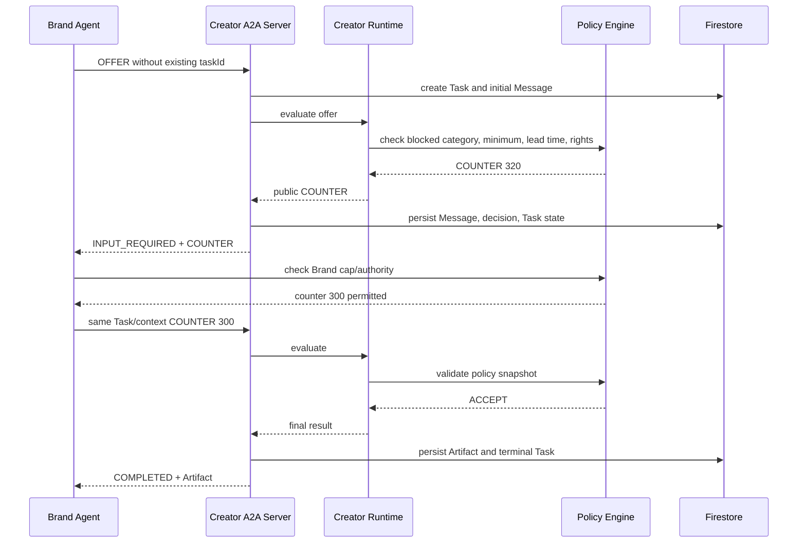

# A2A Negotiation Protocol

## 1. Scope

A2A handles communication with the selected Creator Agent:

- AgentCard and capability/interface discovery;
- Message transport;
- Task creation and state;
- multi-turn negotiation;
- streaming/subscription where supported;
- final Artifact.

A2A does not perform:

- creator database search;
- ranking;
- private policy calculation;
- Agreement persistence semantics;
- escrow or settlement.

Those are KNOT application responsibilities.

## 2. Roles

For sponsorship negotiation:

```text
Brand Agent   = A2A Client
Creator Agent = A2A Server / remote agent
```

The Creator owner does not need an open browser.

## 3. Agent Registry and AgentCard

After a candidate is selected, Brand Agent retrieves the registered AgentCard and validates:

- Agent identity/version;
- supported interface URL;
- protocol binding/version;
- tenant/routing identifier when declared;
- authentication requirements;
- `sponsorship-negotiation` skill;
- input/output media types;
- streaming capability.

Private negotiation policy is not in AgentCard.

Representative structure:

```json
{
  "name": "KNOT Creator Negotiation Agent",
  "description": "Evaluates and negotiates creator sponsorship offers.",
  "supportedInterfaces": [
    {
      "url": "https://service.example/a2a/v1",
      "protocolBinding": "HTTP+JSON",
      "protocolVersion": "1.0",
      "tenant": "creator-agent-001"
    }
  ],
  "version": "1.0.0",
  "capabilities": {
    "streaming": true,
    "pushNotifications": false
  },
  "skills": [
    {
      "id": "sponsorship-negotiation",
      "name": "Sponsorship Negotiation",
      "inputModes": ["application/json"],
      "outputModes": ["application/json"]
    }
  ]
}
```

Codex must verify the installed official A2A package/schema rather than inventing fields if the dependency differs.

## 4. Domain payload

KNOT domain schema:

```text
knot.negotiation.v1
```

Domain message types:

```text
OFFER
COUNTER
ACCEPT
REJECT
ESCALATE
```

These are inside `Part.data`; they are not replacements for A2A protocol enums.

Example:

```json
{
  "mediaType": "application/json",
  "data": {
    "schema": "knot.negotiation.v1",
    "type": "OFFER",
    "round": 1,
    "terms": {
      "baseAmountUsdc": 250,
      "deliverables": [{"format": "REEL", "count": 1}],
      "usageRights": "ORGANIC_ONLY",
      "deadline": "2026-08-10T14:59:59Z"
    },
    "publicRationale": "릴스 1개 조건으로 시작해볼게요."
  }
}
```

Never include Brand hard maximum or Creator exact minimum in public payloads.

## 5. Context and Task mapping

```text
Match Run
├─ candidate 1 Negotiation
│  └─ one A2A negotiation Task, multiple rounds
├─ candidate 2 Negotiation
│  └─ one A2A negotiation Task, multiple rounds
└─ first Agreement stops run
```

```text
contextId = one Brand–Creator transaction context
taskId    = negotiation Task inside that context
```

The server creates a new Task ID for the initial request if required by the binding. Follow-up messages use the same Task/context pair.

## 6. Task states

Use official installed enum values. Product mapping expected by current architecture:

| A2A state | KNOT meaning |
|---|---|
| Submitted | initial offer accepted for processing |
| Working | Agent runtime generating/validating response |
| Input required | counteroffer sent; waiting for Brand Agent response |
| Auth required | additional authority or explicit permitted action required |
| Completed | final Artifact generated |
| Rejected | server refuses Task itself |
| Failed | infrastructure/processing failure |
| Canceled | Task canceled |

A business rejection after valid processing should normally be represented as a completed result Artifact with `result=REJECTED`, preserving the distinction between protocol failure and valid negative outcome.

## 7. Multi-turn sequence



## 8. Decision split

Gemini may produce:

- proposed public rationale;
- proposed counter amount within an allowed band;
- structured extraction of terms;
- negotiation tone.

Deterministic code decides:

- blocked category;
- minimum/maximum bounds;
- lead time;
- rights compatibility;
- maximum rounds;
- authority/escalation;
- whether payment can execute.

Model output is schema-validated and rechecked.

## 9. Final Artifact

Agreed:

```json
{
  "schema": "knot.term-sheet.v1",
  "result": "AGREED",
  "negotiationId": "negotiation-001",
  "terms": {
    "baseAmountUsdc": 300,
    "deliverables": [{"format": "REEL", "count": 1}],
    "usageRights": "ORGANIC_ONLY",
    "deadline": "2026-08-10T14:59:59Z"
  },
  "termsHash": "sha256:..."
}
```

Rejected:

```json
{
  "schema": "knot.negotiation-result.v1",
  "result": "REJECTED",
  "reasonCode": "BUDGET_CONSTRAINT",
  "publicReason": "이번 조건에서는 합의 범위를 찾지 못했어요."
}
```

Agreement Service revalidates and canonicalizes terms before creating the Agreement exactly once.

## 10. HTTP binding

The current KNOT A2A baseline uses HTTP+JSON. Representative operations include:

```text
POST /message:send
POST /message:stream
GET  /tasks/{id}
POST /tasks/{id}:subscribe
POST /tasks/{id}:cancel
```

Required headers and exact envelopes must be confirmed against the installed official SDK/spec. Preserve current working endpoints and add aliases only if necessary.

## 11. Protocol invariants

- Message IDs are unique and deduplicated.
- Task/context binding is validated.
- Terminal Tasks are immutable except permitted metadata reconciliation.
- Stream event order is monotonic.
- `Part` contains one content representation.
- Artifact is the final result, not a UI-only object.
- Counterparty private policy never enters the payload.
- Authentication and tenant routing are verified before Agent context is loaded.
- Body size, rate limit and replay protection are enforced.

## 12. UI projection

A2A payloads are projected into user-friendly timeline items. The frontend receives:

- public terms;
- public rationale;
- role-safe policy event;
- state;
- timestamps;
- technical IDs only where authorized.

It never receives raw private snapshots and hides them with CSS; they remain absent from the DTO.
