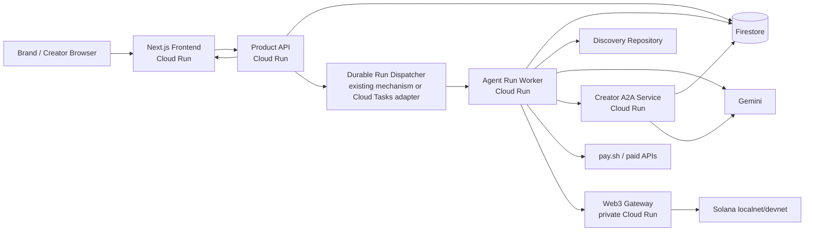

# GCP Architecture, Deployment and Observability

## 1. Architecture principle

Preserve working services. The following are logical boundaries; they may remain within the current deployable units when that reduces risk.



## 2. Existing-system-first rule

Codex must identify:

- actual frontend/backend/web3 deploy units;
- active Cloud Run services and revisions;
- deployment workflows;
- current region/project;
- async mechanism and why Pub/Sub/Cloud Tasks/Workflows is or is not used;
- Firestore mode/database;
- current model API path;
- service accounts and IAM;
- current secret strategy;
- current local/devnet configuration.

No new infrastructure is introduced merely because this diagram contains a box.

## 3. Frontend

- Next.js + TypeScript as existing.
- Preserve current route/components/design.
- Server/client API calls use authenticated Product API.
- Session behavior supports the two-window demo if the current auth setup does.
- No direct broad Firestore canonical write from client.
- Live event reconnect and refresh work.
- Production build served by Cloud Run or existing verified deployment target.

## 4. Product API

Responsibilities:

- auth and role resolution;
- onboarding/analysis APIs;
- Dashboard and detail ViewModels;
- Promotion and Match Run commands;
- event/timeline projection;
- Agreement/evidence/settlement read APIs;
- internal dispatch;
- health/readiness.

Required operational endpoints:

```text
/healthz
/readyz
```

Readiness should verify critical configuration without performing destructive or expensive external operations.

## 5. Durable Match Run execution

A Match Run must survive browser closure and API process restart.

Reuse current worker mechanism if verified. If absent, implement behind:

```python
class AgentRunDispatcher(Protocol):
    async def enqueue(self, match_run_id: str) -> DispatchReceipt: ...
```

A managed queue implementation should provide:

- authenticated Cloud Run target;
- retry with backoff;
- task deduplication/idempotent worker;
- rate/concurrency control;
- dead-letter or failed-operation visibility;
- no secret in payload.

Do not route business progress through client-side timers.

## 6. Firestore

Uses:

- canonical state;
- read-optimized discovery profiles;
- Match Run/Negotiation/A2A state;
- event sequence;
- operation receipts;
- Dashboard projections if existing architecture uses them.

Requirements:

- explicit composite/vector indexes;
- transactions for run creation/reservation/idempotency;
- bounded queries;
- timestamp/version fields;
- ownership enforced at API and Security Rules/IAM boundaries;
- emulator integration where supported.

## 7. Gemini

- server-side calls only;
- structured output;
- prompt/model/schema versioning;
- retry/rate-limit behavior;
- model output validation;
- safe observability metadata;
- no direct financial authority.

Use the repository’s current Gemini/Vertex AI/Google AI Studio integration. Do not migrate model platforms during this refactor unless required for a verified defect.

## 8. A2A service

- current HTTP+JSON baseline;
- AgentCard/tenant routing where current official SDK supports it;
- service auth;
- durable Task/message/artifact storage;
- streaming or Product API projection;
- private policy isolation;
- horizontal stateless runtime.

## 9. Web3 Gateway

Private service boundary:

- authenticated calls only;
- allowlisted operations;
- terms hash validation;
- network/mint/program restrictions;
- spend caps;
- signing secret protection;
- transaction simulation/confirmation/reconciliation;
- idempotency;
- localnet tests and devnet final demo.

## 10. Environments

### Local

- frontend/API local;
- Firestore emulator where configured;
- local worker dispatch adapter;
- local Solana validator/Anchor tests;
- explicit fixtures for external URL/pay.sh only when marked.

### Dev/staging

- Cloud Run services;
- Firestore dev database/project;
- Gemini configured;
- pay.sh sandbox or documented dev mode;
- Solana devnet;
- test users/wallets;
- no production funds.

### Final demo

- live URL;
- actual configured Gemini call;
- actual A2A boundary;
- actual devnet lock/release;
- real transaction signatures;
- no silent simulation in happy path.

### Mainnet

Out of scope.

## 11. IAM and secrets

- one service account per boundary where feasible;
- least privilege;
- no downloaded long-lived service account JSON in repository;
- Cloud Run service-to-service identity;
- secrets in Secret Manager/environment injection according to existing deployment;
- Web3 signer cannot be read by frontend/Product API unless architecture requires and explicitly restricts it;
- secret access audited.

## 12. Observability

### Correlation

Generate/propagate:

```text
requestId
correlationId
matchRunId
negotiationId
contextId
taskId
agreementId
operationId
```

### Structured logs

Each state transition logs:

- event type;
- old/new state;
- safe resource IDs;
- actor/service;
- latency;
- retry count;
- error code;
- build revision.

### Metrics

- analysis success/latency;
- discovery query latency and returned count;
- no-candidate rate;
- Match Run completion/exhaustion/failure;
- candidates attempted per Agreement;
- negotiation rounds and outcomes;
- A2A error/latency;
- paid verification spend/success;
- Agreement duplicate prevention;
- escrow/release success and confirmation time;
- event stream reconnect/error;
- queue age and worker retries.

### Alerts for demo readiness

- Cloud Run 5xx;
- queue backlog;
- A2A failure spike;
- Firestore permission/index errors;
- Web3 operation failure;
- low devnet wallet balance;
- secret/config missing;
- deployment revision mismatch.

## 13. Deployment safeguards

- build/test before deploy;
- deploy revision tagged with commit SHA;
- smoke `/healthz`, `/readyz`, `/api/v1/me`;
- role login smoke;
- one dry Match Run without payment if safe;
- devnet transaction smoke using test asset;
- verify frontend points to the intended API revision;
- preserve previous revision for rollback;
- do not claim deployed until live URL is tested.

## 14. Cost safeguards

- Cloud Run scale-to-zero/min instances based on demo latency needs;
- concurrency bounded for Agent worker;
- URL/Gemini analysis result caching by content/version;
- bounded vector Top K;
- paid API cap;
- log retention and payload minimization;
- no full dataset scans;
- budget alerts.
