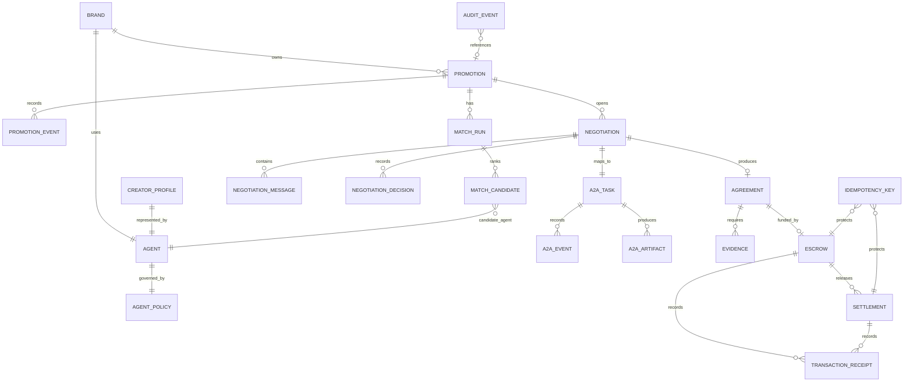

# Firestore Runbook

## 1. Purpose

Firestore Native mode is the source of truth for KNOT v1 operational state:

- seeded demo brand, creators, agents and policies
- Promotion lifecycle
- deterministic match results
- negotiation state, messages and decisions
- final Agreement terms and hash
- evidence, escrow, settlement and receipt records when those flows are wired
- append-only audit events and idempotency keys

The browser must not write privileged business collections directly. Product API,
Creator Agent and web3 gateway services own writes through repository code and
service IAM.

## 2. Current Implementation

Backend persistence currently uses a repository boundary:

```text
backend/libs/repositories/firestore_paths.py
backend/libs/repositories/serialization.py
backend/libs/repositories/store.py
backend/libs/repositories/firestore_adapter.py
backend/libs/repositories/seed.py
```

The Product API can run in two modes:

```text
KNOT_REPOSITORY_BACKEND=memory
KNOT_REPOSITORY_BACKEND=firestore
```

`memory` is the default local mode. It loads deterministic demo fixtures on app
startup and is used by unit/contract tests.

`firestore` uses `google-cloud-firestore` through `FirestoreDocumentStore`. It
expects application default credentials and a configured GCP project.

## 3. Collections

Canonical collection paths are defined in `docs/06_DOMAIN_DATA_MODEL.md` and
implemented by `FirestorePaths`.

```text
brands/{brandId}
creatorProfiles/{creatorId}
agents/{agentId}
agentPolicies/{agentId}
promotions/{promotionId}
promotions/{promotionId}/events/{eventId}
matchRuns/{matchRunId}
matchRuns/{matchRunId}/candidates/{creatorAgentId}
negotiations/{negotiationId}
negotiations/{negotiationId}/messages/{messageId}
negotiations/{negotiationId}/decisions/{decisionId}
a2aTasks/{taskId}
a2aTasks/{taskId}/events/{eventId}
a2aTasks/{taskId}/artifacts/{artifactId}
agreements/{agreementId}
evidence/{evidenceId}
escrows/{escrowId}
settlements/{settlementId}
transactionReceipts/{receiptId}
auditEvents/{eventId}
idempotencyKeys/{key}
```

All JSON and Firestore field names use `camelCase`. Python code may use snake
case internally only through Pydantic aliases.

## 4. ERD



Entity key fields:

```text
BRAND.brandId
CREATOR_PROFILE.creatorId, creatorAgentId
AGENT.agentId
AGENT_POLICY.agentId, policyVersion
PROMOTION.promotionId, brandId, brandAgentId
MATCH_RUN.matchRunId, promotionId, selectedCreatorAgentId
MATCH_CANDIDATE.creatorAgentId, eligible, score, rank
NEGOTIATION.negotiationId, promotionId, contextId, taskId, status, currentRound
NEGOTIATION_MESSAGE.messageId, contextId, taskId, role, sequence
NEGOTIATION_DECISION.decisionId, messageId, type, policyDecision
AGREEMENT.agreementId, negotiationId, termsHash, status
EVIDENCE.evidenceId, agreementId, status, policyDecision
ESCROW.escrowId, agreementId, termsHash, status
SETTLEMENT.settlementId, escrowId, milestoneId, idempotencyKey, status
TRANSACTION_RECEIPT.receiptId, signature, status
AUDIT_EVENT.eventId, type, createdAt
IDEMPOTENCY_KEY.key, payloadHash, ownerPath
```

## 5. Seed Data

Committed demo fixtures live in `backend/fixtures/`:

```text
brands.json
agents.json
creators.json
agent_policies.json
promotions.json
matching_golden.json
```

The seed command is idempotent for known document IDs:

```text
.venv/bin/python scripts/seed_demo.py --target memory
.venv/bin/python scripts/seed_demo.py --target firestore --project <gcp-project-id>
```

Current memory seed output should load 12 documents:

```text
brands/brand-001
agents/brand-agent-001
agents/creator-agent-001
agents/creator-agent-002
agents/creator-agent-003
creatorProfiles/creator-001
creatorProfiles/creator-002
creatorProfiles/creator-003
agentPolicies/creator-agent-001
agentPolicies/creator-agent-002
agentPolicies/creator-agent-003
promotions/promotion-001
```

Do not manually edit Firestore during the recorded demo. Fix fixture or seed
code, then reseed.

## 6. Local Firestore Emulator

Firestore emulator integration is not wired yet. When added, use this shape:

```text
gcloud emulators firestore start --host-port=127.0.0.1:8085
export FIRESTORE_EMULATOR_HOST=127.0.0.1:8085
export KNOT_REPOSITORY_BACKEND=firestore
export GOOGLE_CLOUD_PROJECT=knot-agentic-dev
.venv/bin/python scripts/seed_demo.py --target firestore --project knot-agentic-dev
.venv/bin/python scripts/firestore_smoke.py --target firestore --project knot-agentic-dev
```

If the Google Cloud CLI is not installed, install it before using the emulator.
Java is also required by the emulator runtime.

Emulator tests should verify repository behavior that cannot be proven by the
in-memory store:

- create-if-absent semantics for append-only audit events
- idempotency key conflict behavior under concurrent writes
- negotiation round increments in transactions
- escrow and settlement write ordering once payment endpoints are connected

## 7. GCP Firestore Setup

Create Firestore in Native mode once per project. The expected hackathon project
and region are documented in `docs/04_GCP_INFRASTRUCTURE.md`, but the actual
project ID must be configured rather than hardcoded.

Required runtime settings:

```text
KNOT_REPOSITORY_BACKEND=firestore
GOOGLE_CLOUD_PROJECT=<gcp-project-id>
```

`GCP_PROJECT_ID` is accepted as a local fallback, but Google client libraries use
`GOOGLE_CLOUD_PROJECT` by convention.

Runtime service accounts:

- `knot-api-sa`: Firestore user
- `knot-creator-agent-sa`: Firestore user
- `knot-web3-sa`: limited Firestore access for agreement/payment validation
- `knot-web-sa`: no privileged Firestore admin or business direct-write access

Do not commit service account JSON files or downloaded credentials.

## 8. Indexes

No composite indexes are currently required by implemented queries. Existing
repository reads are direct document lookups or collection scans for the demo
dataset.

Before adding query filters or ordered list APIs, add index requirements here and
track the deployable index file in source. Likely future indexes:

```text
promotions: brandId ASC, status ASC, createdAt DESC
matchRuns: promotionId ASC, createdAt DESC
negotiations: promotionId ASC, createdAt DESC
evidence: agreementId ASC, createdAt DESC
escrows: agreementId ASC
settlements: escrowId ASC, milestoneId ASC
transactionReceipts: idempotencyKey ASC
auditEvents: promotionId ASC, createdAt DESC
```

## 9. Write Rules and Invariants

Repository/API code must preserve these invariants:

- terminal negotiations reject new messages
- `currentRound` increments once per accepted unique message
- policy snapshots are immutable after negotiation start
- Agreement `canonicalTermsJson` and `termsHash` are deterministic
- audit events are append-only
- payment actions require idempotency keys
- duplicate idempotency key with the same payload is a replay
- duplicate idempotency key with a different payload is a conflict
- escrow and settlement writes must be protected by transactions when wired

LLM output must not authorize writes that move money. Policy code and the web3
gateway must approve escrow lock and release.

## 10. Implemented API Persistence

Current Product API routes write or read these collections:

```text
POST /api/v1/promotions
GET  /api/v1/promotions
GET  /api/v1/promotions/{promotionId}
POST /api/v1/promotions/{promotionId}:activate
POST /api/v1/promotions/{promotionId}/matches:run
GET  /api/v1/promotions/{promotionId}/timeline
GET  /api/v1/match-runs/{matchRunId}
GET  /api/v1/match-runs/{matchRunId}/candidates
POST /api/v1/match-runs/{matchRunId}/candidates/{creatorAgentId}:select
POST /api/v1/match-runs/{matchRunId}:start-negotiation
GET  /api/v1/negotiations/{negotiationId}
GET  /api/v1/negotiations/{negotiationId}/messages
GET  /api/v1/negotiations/{negotiationId}/events
POST /api/v1/negotiations/{negotiationId}:cancel
GET  /api/v1/agreements/{agreementId}
POST /api/v1/agreements/{agreementId}/evidence
GET  /api/v1/evidence/{evidenceId}
POST /api/v1/evidence/{evidenceId}:verify
```

Evidence verification writes `status`, `observations`, `policyDecision`,
`verifiedAt` and `updatedAt` back to `evidence/{evidenceId}`, and appends
Promotion timeline events.

Payment mutation endpoints remain deferred until web3 signing work resumes.

## 11. Verification

Run these checks after DB/API changes:

```text
.venv/bin/python -m ruff check backend scripts/seed_demo.py
.venv/bin/python -m mypy backend/apps backend/libs
.venv/bin/python -m pytest backend/tests
.venv/bin/python scripts/seed_demo.py --target memory
.venv/bin/python scripts/firestore_smoke.py --target memory
git diff --check
```

Expected current test result:

```text
39 passed
```

Known warning: FastAPI/Starlette TestClient currently emits one deprecation
warning related to `httpx`.
