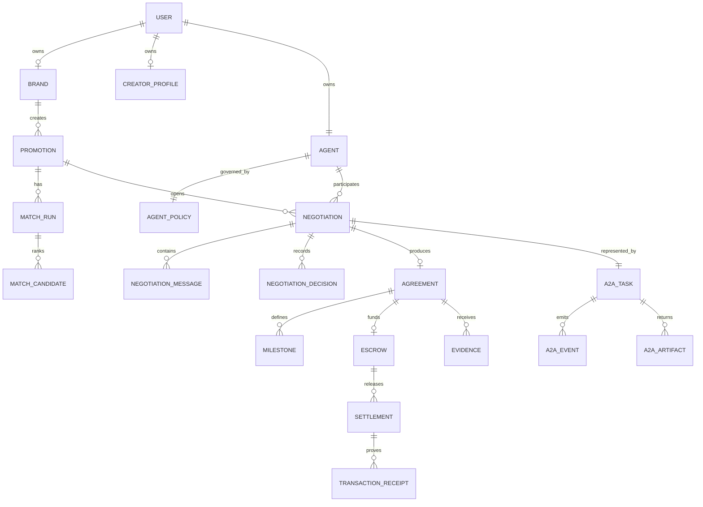
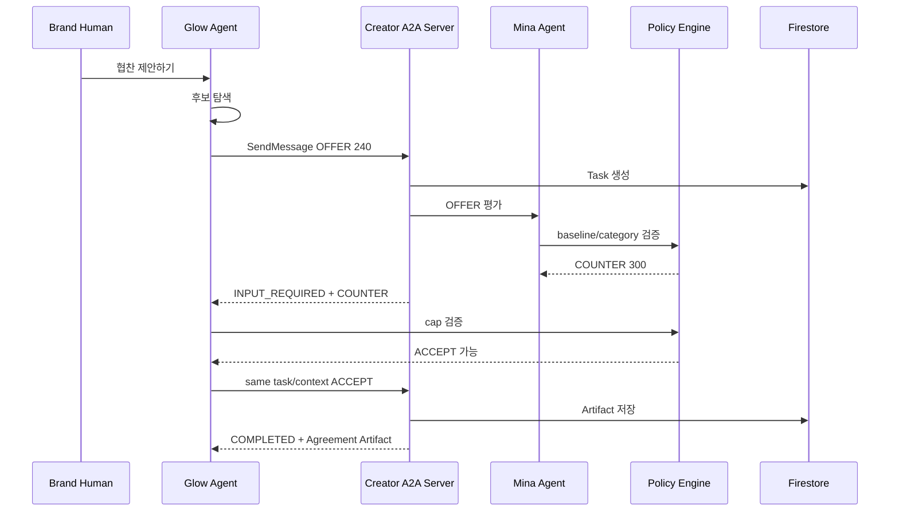

# KNOT v2 Complete Documentation


---

# FILE: 00_DOCUMENT_INDEX.md

# KNOT v2 문서 인덱스

> **문서 버전:** v2  
> **상태:** 구현 기준 확정  
> **UI/UX 기준:** `origin/feat/two-user-session`  
> **Backend/API/Web3 기준:** 현재 실제 기능이 동작하는 안정 브랜치  
> **충돌 시 최우선 문서:** `KNOT_PRODUCT_MASTER_SPEC_V2.md`

---

## 1. 이 문서 세트의 목적

이 폴더는 KNOT의 제품 기획, 페이지 플로우, 데이터 모델, API, A2A 협상, Solana 에스크로, 정산, 보안, 테스트, 배포 기준을 하나로 통일한다.

과거 문서와 새 문서가 충돌해 다음과 같은 문제가 다시 발생하지 않도록 한다.

- 기존 긴 온보딩과 two-window 온보딩이 동시에 남는 문제
- 마이페이지와 설정이 여러 위치에 중복되는 문제
- 대시보드와 Agent 채팅 UI가 서로 다른 제품처럼 보이는 문제
- Mock 협상과 실제 A2A가 구분되지 않는 문제
- `SIMULATED` 에스크로를 실제 온체인 결제로 오해하는 문제
- Campaign, Deal, Promotion 용어가 혼용되는 문제

---

## 2. Source of Truth 우선순위

1. `KNOT_PRODUCT_MASTER_SPEC_V2.md`
2. 역할별 전문 문서
   - `06_DATA_MODEL.md`
   - `07_API_CONTRACTS.md`
   - `08_A2A_AGENT_RUNTIME.md`
   - `09_ESCROW_AND_SETTLEMENT.md`
   - `11_SECURITY_AND_AUTHORIZATION.md`
   - `13_TEST_AND_ACCEPTANCE.md`
3. 운영 문서
   - `FIREBASE_AUTH_SETUP.md`
   - `IMPLEMENTATION_STATUS.md`
   - `HANDOFF.md`
4. 코드와 실제 배포 상태

문서와 코드가 다르면 임의로 어느 한쪽을 사실로 간주하지 않는다. `IMPLEMENTATION_STATUS.md`에 차이를 기록하고 코드 또는 문서를 명시적으로 갱신한다.

---

## 3. 문서 목록

| 문서 | 목적 |
|---|---|
| `KNOT_PRODUCT_MASTER_SPEC_V2.md` | 전체 제품·기술 결정 요약 |
| `01_PRODUCT_PRD.md` | 문제, 사용자, 가치, 목표, 성공 기준 |
| `02_SCOPE_AND_GLOSSARY.md` | MVP 범위와 용어 |
| `03_INFORMATION_ARCHITECTURE_AND_ROUTES.md` | 메뉴, Route, 전환, Guard |
| `04_AUTH_ONBOARDING_DASHBOARD.md` | 로그인, 온보딩, Manager 연결, 대시보드 |
| `05_PAGE_SPEC.md` | 페이지별 UI·CTA·데이터·상태 |
| `06_DATA_MODEL.md` | Firestore 모델, 관계, 불변조건 |
| `07_API_CONTRACTS.md` | 사용자 API·A2A 지원 API 계약 |
| `08_A2A_AGENT_RUNTIME.md` | Agent discovery, Task, multi-turn 협상 |
| `09_ESCROW_AND_SETTLEMENT.md` | Agreement, termsHash, escrow, evidence, release |
| `10_DEV_ADMIN.md` | 개발·운영 진단 화면 |
| `11_SECURITY_AND_AUTHORIZATION.md` | 인증, 권한, 개인정보, Web3 안전 |
| `12_MIGRATION_AND_CUTOVER.md` | 기존 브랜치·DB·Route 이전 |
| `13_TEST_AND_ACCEPTANCE.md` | 테스트와 완료 기준 |
| `14_CODEX_EXECUTION_GUIDE.md` | Codex 실행 절차와 제약 |
| `15_TOKEN_BUDGET_STRATEGY.md` | Gemini/Codex/pay.sh 비용·한도 |
| `16_DEMO_AND_SUBMISSION.md` | 3분 데모와 제출 체크리스트 |
| `17_UI_COPY_AND_STATES.md` | 확정 문구와 사용자 상태명 |
| `18_REFERENCES.md` | 제공 자료와 공식 참고 |
| `19_AGENT_RULES.md` | 루트 `AGENTS.md`에 반영할 규칙 |
| `FIREBASE_AUTH_SETUP.md` | Firebase 설정과 탭별 세션 |
| `IMPLEMENTATION_STATUS.md` | 실제 구현·검증 현황 |
| `HANDOFF.md` | 팀 인수인계와 실행법 |
| `README_REPLACE_EXISTING_DOCS.md` | 기존 docs 교체 방법 |

---

## 4. 권장 읽기 순서

### 기획·프론트

```text
KNOT_PRODUCT_MASTER_SPEC_V2
→ 01_PRODUCT_PRD
→ 03_INFORMATION_ARCHITECTURE_AND_ROUTES
→ 04_AUTH_ONBOARDING_DASHBOARD
→ 05_PAGE_SPEC
→ 17_UI_COPY_AND_STATES
```

### 백엔드·Agent

```text
06_DATA_MODEL
→ 07_API_CONTRACTS
→ 08_A2A_AGENT_RUNTIME
→ 11_SECURITY_AND_AUTHORIZATION
```

### Web3

```text
09_ESCROW_AND_SETTLEMENT
→ 11_SECURITY_AND_AUTHORIZATION
→ 13_TEST_AND_ACCEPTANCE
```

### Codex 작업

```text
14_CODEX_EXECUTION_GUIDE
→ 12_MIGRATION_AND_CUTOVER
→ IMPLEMENTATION_STATUS
```

---

## 5. 구현 결정 규칙

- 화면 순서·카피·시각 언어는 `feat/two-user-session`을 우선한다.
- 기존 실제 API와 A2A·Web3 코드는 최대한 유지한다.
- UI와 API 모델이 다르면 Adapter/ViewModel을 만든다.
- Mock 성공을 실제 성공처럼 표시하지 않는다.
- 모든 새 페이지와 API는 역할·소유권 검사를 통과해야 한다.
- `Promotion`이 사용자 업무의 중심이고 `Agent`는 실행 주체다.
- 전체 협상 대화는 Negotiation Detail에서 보여주며, Dashboard에는 요약만 둔다.
- `매니저 붙이기`는 Agent 생성이며 협상 시작이 아니다.
- Creator의 `협찬 받기`, Brand의 `협찬 제안하기`가 실제 Agent run의 시작점이다.


---

# FILE: 01_PRODUCT_PRD.md

# KNOT Product Requirements Document

## 1. 배경

Creator Promotion 시장은 상대 탐색, DM, 단가 협상, 계약, 검수, 정산이 서로 다른 도구와 사람의 수작업으로 분리돼 있다.

Brand는 적합한 Creator를 찾고도 응답을 받지 못하거나, 매번 기준이 다른 가격·사용권·일정을 협상한다. Creator는 제안을 놓치고, 원치 않는 업종을 반복적으로 거절하며, 정산 지연 위험을 부담한다.

KNOT은 각 사용자에게 AI Manager를 붙이고, 사용자가 정한 기준 안에서 Agent가 탐색·협상·계약·에스크로·정산을 수행하게 한다.

---

## 2. 목표 사용자

### Primary: 소규모·중소 Brand 운영자

- Agency 없이 Creator Promotion을 운영한다.
- 제품 단위 예산과 딜당 한도를 관리해야 한다.
- Creator 탐색, 협상, 계약, 정산을 한 화면에서 보고 싶다.

### Primary: 마이크로·미드티어 Creator

- Instagram Reel 중심의 협찬을 받는다.
- 최소 단가와 하지 않을 업종이 명확하다.
- 제안 선별과 협상을 Agent에게 맡기고 싶다.
- Escrow와 지급 상태를 투명하게 보고 싶다.

### Secondary: 운영·개발 담당자

- A2A Task, API 상태, transaction receipt를 진단한다.
- 일반 사용자 UI와 분리된 Dev/Admin을 사용한다.

---

## 3. Job To Be Done

Brand:

> 제품을 홍보할 Creator를 찾고 싶을 때, 예산과 무드만 알려주면 내 Agent가 적합한 후보를 찾고 조건을 협상해 실제 계약과 에스크로까지 끝내주길 원한다.

Creator:

> 협찬 제안이 들어올 때, 내 최소 단가와 금지 업종을 기억하는 Agent가 자동으로 선별·역제안하고, 합의된 돈이 Escrow에 잠겼는지 확인해주길 원한다.

---

## 4. 문제

### Brand Pain

- 후보 탐색에 시간이 많이 든다.
- DM 응답률과 협상 상태를 관리하기 어렵다.
- 예산을 넘는 계약을 사전에 통제하기 어렵다.
- 계약과 지급 상태가 분리돼 있다.
- 여러 Creator와의 협상 내역을 한눈에 보기 어렵다.

### Creator Pain

- 제안을 놓친다.
- 낮은 가격에 반복 대응한다.
- 금지 업종을 매번 직접 거절한다.
- 협상 결과와 지급 보장이 약하다.
- 게시 후 정산 시점과 잔액을 알기 어렵다.

---

## 5. 솔루션

### 최소 온보딩

Brand:
- 제품 URL
- 무드
- 총예산
- 딜당 한도

Creator:
- Instagram username
- 마지노선
- 금지 카테고리

### Agent 실행

- Brand Agent: 후보 탐색, OFFER, budget policy, ACCEPT/ESCALATE
- Creator Agent: inbound evaluation, minimum policy, COUNTER/REJECT
- 사람: 정책을 설정하고 한도 밖의 요청만 승인

### 신뢰 레이어

- A2A Task와 메시지 기록
- 구조화 Agreement
- `termsHash`
- Solana USDC Escrow
- Evidence와 milestone release
- Transaction receipt와 Explorer

---

## 6. 제품 원칙

1. **짧게 입력하고, 깊게 자동화한다.**
2. **Agent의 행동은 눈에 보이지만, private policy는 숨긴다.**
3. **대화는 설명 UX이고, Agreement가 법적·시스템 결과다.**
4. **LLM은 제안하고 deterministic policy가 결정한다.**
5. **결제 성공은 transaction receipt로 증명한다.**
6. **한 화면에는 하나의 primary action만 둔다.**
7. **Mock과 실제 실행을 혼동시키지 않는다.**

---

## 7. 핵심 사용자 시나리오

### Happy Path

1. Creator가 Instagram을 연결한다.
2. 300 USDC와 금지 업종을 설정한다.
3. Mina Agent를 붙인다.
4. Dashboard에서 `협찬 받기`를 켠다.
5. Brand가 제품 URL, 무드, 2,000/800 USDC를 설정한다.
6. Glow Agent를 붙이고 `협찬 제안하기`를 누른다.
7. 후보 3명 중 @demobeauty를 선택한다.
8. Glow Agent가 240 USDC를 OFFER한다.
9. Mina Agent가 300 USDC를 COUNTER한다.
10. Glow Agent가 cap 내에서 ACCEPT한다.
11. Agreement와 `termsHash`가 생성된다.
12. 300 USDC가 Solana devnet Escrow에 잠긴다.
13. Creator가 Reel URL을 제출한다.
14. 검증 후 30/70 milestone이 지급된다.

### Policy Reject

- Creator blocked category에 해당한다.
- Creator Agent가 REJECT한다.
- Brand에는 sanitized reason만 보인다.
- Agreement와 Escrow는 생성되지 않는다.

### Human Approval

- Creator COUNTER가 Brand per-deal cap을 넘는다.
- Task가 승인 필요 상태가 된다.
- Brand가 승인, 수정, 거절한다.
- 같은 Task로 협상을 재개한다.

---

## 8. 목표

### P0

- 두 역할의 실제 Firebase 로그인
- two-window 온보딩
- Agent 연결
- 역할별 Dashboard
- Agent 활성화
- Promotion과 후보
- 실제 A2A OFFER→COUNTER→ACCEPT
- Agreement Artifact
- Solana devnet Escrow
- Evidence URL
- Milestone release
- 실제 receipt/Explorer
- `/mypage` 통합

### P1

- pay.sh/x402 API spend receipt
- 여러 협상 동시 streaming
- social refresh
- advanced policy
- performance bonus

---

## 9. 제외

- Mainnet
- 원화 결제
- 완전한 Instagram private API 연동
- 다중 SNS
- 캘린더 재협상
- 노쇼 보증금
- 복잡한 분쟁 중재
- 평판 그래프 고도화
- 대규모 marketplace
- 임의 상태를 수정하는 Admin

---

## 10. 성공 지표

제품:
- 신규 사용자가 2분 안에 Agent 연결
- Brand가 3분 안에 첫 Negotiation 시작
- 최소 한 번의 A2A COUNTER
- Agreement 생성 성공률
- Escrow lock/release 성공률
- 중복 Agreement·지급 0건

데모:
- 3분 안에 핵심 흐름 이해
- 실제 devnet signature 표시
- 두 Agent의 정책 차이를 UI로 설명
- Dashboard와 상세 대화의 역할이 명확
- 심사위원이 “왜 Agent와 Solana가 필요한가”를 바로 이해


---

# FILE: 02_SCOPE_AND_GLOSSARY.md

# KNOT v2 범위와 용어

## 1. MVP 범위

### 사용자 계정

- Firebase email/password
- Brand/Creator role
- tab별 독립 session
- onboarding resume
- `/mypage`

### Brand

- Product source 분석
- Mood 선택
- total budget
- per-deal cap
- Brand Agent
- Draft Promotion
- candidate list
- negotiation list/detail
- Agreement
- Escrow summary
- evidence review
- settlement history

### Creator

- Instagram source 연결
- profile snapshot
- minimum baseline
- blocked categories
- Creator Agent
- `협찬 받기` availability
- offer/negotiation list
- sponsorship detail
- evidence URL
- settlement claim/history

### Agent/A2A

- AgentCard
- Registry
- one-counter multi-turn
- OFFER/COUNTER/ACCEPT/REJECT/ESCALATE
- Task state
- streaming or polling
- Artifact
- sanitized activity timeline
- idempotency

### Web3

- Solana localnet/devnet
- USDC-like devnet mint or approved test asset
- escrow lock
- milestone release
- receipt
- Explorer link
- no mainnet

---

## 2. P1

- pay.sh/x402 receipt
- paid profile verification API
- advanced policy
- multiple concurrent streams
- creator performance bonus
- public reputation
- notification channel

---

## 3. Out of Scope

- 원화/카드 결제
- mainnet
- custody productionization
- KYC/KYB production
- 분쟁·환불 일반화
- 일정 캘린더 자동 협상
- 노쇼 보증금
- 다중 SNS 전체 수집
- 자동 세금 처리
- real-world legal contract
- unrestricted LLM autonomous spending

---

## 4. Glossary

| 용어 | 정의 |
|---|---|
| Brand | 제품 홍보를 요청하고 보수를 예치하는 사용자 |
| Creator | 콘텐츠를 제작하고 보수를 받는 사용자 |
| Manager | 사용자에게 보이는 Agent 명칭 |
| Agent | 탐색·협상·계약·정산 실행 주체 |
| Agent Policy | 외부에 공개되지 않는 가격·업종·한도 기준 |
| Agent Authority | Agent가 사람 승인 없이 실행 가능한 범위 |
| Promotion | Brand의 홍보 프로젝트 |
| Candidate | Promotion에 적합하다고 평가된 Creator |
| Match Run | Promotion 후보를 탐색·평가한 실행 |
| Negotiation | Brand Agent와 Creator Agent 사이 협상 |
| Context | 하나의 Brand–Creator 거래 문맥 |
| A2A Task | 상태가 있는 Agent 간 작업 |
| Message | Agent 간 한 번의 통신 단위 |
| Artifact | Task의 구조화된 최종 결과 |
| Agreement | 합의 조건의 canonical 저장 객체 |
| termsHash | canonical Agreement terms의 SHA-256 |
| Escrow | Agreement 자금을 잠그는 온체인 계정/프로그램 |
| Evidence | Creator가 제출한 콘텐츠 URL과 검증 결과 |
| Milestone | Agreement 금액을 분할 지급하는 조건 |
| Settlement | milestone 충족 후 자금 지급 |
| Receipt | 온체인 transaction 결과 저장 객체 |
| Activity Timeline | canonical 이벤트를 사용자 문장으로 투영한 목록 |
| pay.sh/x402 | Agent가 외부 API 사용료를 호출 단위로 지급하는 결제 |
| Devnet | 실제 네트워크와 유사한 Solana 공용 개발망 |
| Demo Mode | 명시적으로 Mock 데이터를 사용하는 로컬/시연 모드 |

---

## 5. 용어 사용 규칙

사용자 UI:
- `매니저`
- `협찬 프로젝트`
- `협상`
- `계약`
- `에스크로`
- `정산`

코드/DB:
- `Agent`
- `Promotion`
- `Negotiation`
- `Agreement`
- `Escrow`
- `Settlement`

금지:
- 새 코드에서 `campaign`와 `Promotion` 혼용
- `deal`을 canonical collection 이름으로 사용
- `contract hash`로 Agreement ID와 transaction signature를 혼용
- `결제` 하나로 pay.sh와 Promotion Escrow를 혼용

---

## 6. 공개 범위

공개:
- 상대 Agent가 제안한 조건
- 공개 rationale
- Agreement
- Escrow와 milestone

본인 전용:
- 자신의 baseline/cap
- 자신의 blocked categories
- 자신의 private notes

운영 전용:
- raw A2A
- raw model output
- secret
- retry metadata

상대에게 공개 금지:
- 정확한 private threshold
- 전체 policy snapshot
- chain-of-thought


---

# FILE: 03_INFORMATION_ARCHITECTURE_AND_ROUTES.md

# Information Architecture & Routes

## 1. Navigation 원칙

- 사용자 업무의 중심은 Promotion/협찬 기록이다.
- Agent는 별도 복잡한 Control Center가 아니라 Dashboard와 협상 상세에서 보인다.
- A2A protocol 데이터는 `/dev/admin`에서만 기본 노출한다.
- `/mypage` 하나로 프로필·설정·지갑을 통합한다.

---

## 2. Public Routes

```text
/
 /login
 /signup
 /onboarding/brand
 /onboarding/creator
```

`/onboarding/*`는 내부 step state를 가진다. 새로고침하면 서버의 onboarding state로 복원한다.

---

## 3. Brand Routes

```text
/brand
/brand/promotions
/brand/promotions/new
/brand/promotions/[promotionId]
/brand/promotions/[promotionId]/candidates
/brand/negotiations
/brand/negotiations/[negotiationId]
/brand/agreements/[agreementId]
/brand/escrows
/brand/escrows/[escrowId]
/brand/settlements
```

Brand 메뉴:

```text
홈
Promotions
협상 내역
정산
```

Global header:
- KNOT logo
- 알림
- 사용자 avatar/name → `/mypage`

---

## 4. Creator Routes

```text
/creator
/creator/offers
/creator/negotiations
/creator/negotiations/[negotiationId]
/creator/sponsorships
/creator/sponsorships/[agreementId]
/creator/escrows
/creator/escrows/[escrowId]
/creator/settlements
```

Creator 메뉴:

```text
홈
제안
진행 중 협찬
정산
```

---

## 5. Common / Dev

```text
/mypage
/dev/admin
/dev/a2a
```

`/dev/*`는 개발 환경 또는 ADMIN role만 접근한다.

---

## 6. 핵심 전환

### Creator

```text
/login
→ /onboarding/creator
→ /creator
→ 협찬 받기 ON
→ /creator/negotiations/[id]
→ /creator/sponsorships/[agreementId]
→ /creator/settlements
```

### Brand

```text
/login
→ /onboarding/brand
→ /brand
→ 협찬 제안하기
→ /brand/promotions/[id]/candidates
→ /brand/negotiations/[id]
→ /brand/agreements/[id]
→ /brand/escrows/[id]
```

---

## 7. Route Guard

Resolution 순서:

```text
Auth loading
→ signed out
→ role missing
→ onboarding incomplete
→ wrong role
→ allowed
```

```ts
type EntryResolution =
  | { kind: "LOADING" }
  | { kind: "SIGNED_OUT"; to: "/login" }
  | { kind: "ROLE_REQUIRED"; to: "/signup" }
  | { kind: "ONBOARDING_REQUIRED"; to: "/onboarding/brand" | "/onboarding/creator" }
  | { kind: "WRONG_ROLE"; to: "/brand" | "/creator" }
  | { kind: "READY" };
```

---

## 8. Legacy Redirect

| 기존 | 새 Route |
|---|---|
| `/brand/me` | `/mypage` |
| `/brand/settings` | `/mypage` |
| `/creator/me` | `/mypage` |
| `/creator/settings` | `/mypage` |
| `/brand/negotiate` | 관련 Negotiation |
| `/brand/result` | 관련 Agreement |
| `/creator/result` | `/creator/negotiations` |
| `/brand/settlement` | `/brand/settlements` |
| `/creator/settlement` | `/creator/settlements` |

Legacy route는 데이터가 없으면 역할 Dashboard로 안전하게 이동한다.

---

## 9. Direct URL / Refresh

- 모든 detail route는 URL parameter로 canonical 데이터를 다시 조회한다.
- 메모리 state만으로 페이지를 구성하지 않는다.
- 권한 없는 ID는 403, 존재하지 않는 ID는 404.
- 마지막으로 생성된 객체를 global query로 찾지 않는다.
- route loader가 현재 사용자와 owner relation을 검증한다.

---

## 10. 알림 진입

알림 유형:
- 신규 제안
- 승인 필요
- 협상 완료
- Escrow funding 필요
- 게시물 제출 필요
- Evidence 검증 결과
- 정산 가능
- Transaction 실패

각 알림은 canonical detail route로 이동한다.


---

# FILE: 04_AUTH_ONBOARDING_DASHBOARD.md

# Auth, Onboarding & Dashboard

## 1. Firebase Authentication

- 실제 Firebase email/password 인증
- Firebase ID Token을 Product API에 전달
- `browserSessionPersistence` 사용
- 같은 브라우저의 서로 다른 탭에서 Brand/Creator를 각각 로그인 가능
- role은 backend source of truth
- role card 클릭만으로 production user를 만들지 않는다

```ts
await setPersistence(auth, browserSessionPersistence);
await signInWithEmailAndPassword(auth, email, password);
```

---

## 2. Onboarding 공통 원칙

- `feat/two-user-session/knot/frontend/src/features/onboard`를 UI 기준으로 사용
- 긴 문장형 form을 제거
- URL 또는 username → 분석 → 최소 기준 → Manager
- `매니저 붙이기` 후 Dashboard
- Manager 연결 직후 협상 시작 금지
- API가 분석하지 못한 값을 fake로 표시하지 않는다
- 기존 사용자는 완료한 단계를 다시 입력하지 않는다

---

## 3. Brand Onboarding

### Step 1 — 제품 링크만 주세요

카피:

```text
제품 링크만 주세요
붙여넣으면 나머지는 매니저가 읽어옵니다.
```

입력:
- Product URL

표시/수정:
- 제품명
- 가격
- 카테고리
- 설명
- 이미지

CTA:
- `읽어오기`
- `무드 고르러 가기`

저장:
- Brand source/profile
- Product snapshot

### Step 2-A — 어떤 무드가 좋으세요?

카피:

```text
어떤 무드가 좋으세요?
1 / 10 · ← → 키로도 넘길 수 있어요
```

Interaction:
- image card
- `✕ 아니야`
- `♡ 이런 느낌`

출력:
- moodTags

### Step 2-B — 한도만 정하면 끝이에요

입력:
- 총 예산
- 딜당 한도

설명:

> 매니저가 한 건에 딜당 한도까지는 물어보지 않고 씁니다.

CTA:
- `매니저 붙이기`

저장:
- first Promotion `DRAFT`
- totalBudgetUsdc
- perDealCapUsdc
- Brand Agent Policy
- Brand Agent

완료:
- `availability=OFFLINE`
- `/brand`

---

## 4. Creator Onboarding

### Step 1 — 인스타그램만 연결하면 돼요

카피:

```text
인스타그램만 연결하면 돼요
사용자이름만 알려주세요. 나머지는 매니저가 알아서 봅니다.
```

입력:
- `@username` 또는 Instagram URL

표시:
- handle
- collectedAt
- follower count
- average views
- engagement rate
- reels ratio
- style tags

실제 수집이 없으면 지표를 표시하지 않고 user-confirmed state를 사용한다.

CTA:
- `분석`
- `맞아요, 계속`

### Step 2 — 두 개만 정하면 끝이에요

입력:
1. 마지노선 `minimumBaseUsdc`
2. 안 하는 카테고리 `blockedCategories`

설명:

```text
이 밑으로 들어오는 제안은 매니저가 알아서 거절해요.
돈은 협상해도, 이건 협상하지 않아요.
```

CTA:
- `매니저 붙이기`

저장:
- Creator Profile
- Social Snapshot
- Style Tags
- Creator Agent Policy
- Creator Agent

완료:
- `availability=OFFLINE`
- `acceptingOffers=false`
- `/creator`

---

## 5. Manager 연결과 활성화

### Manager 연결

```text
Agent create/update
→ profileRef
→ policyRef
→ status=ACTIVE
→ availability=OFFLINE
→ acceptingOffers=false
→ onboardingCompleted=true
```

### Creator `협찬 받기`

ON:
- `acceptingOffers=true`
- `availability=AVAILABLE`
- 신규 매칭 대상이 됨

OFF:
- 신규 OFFER를 받지 않음
- 기존 Agreement/Escrow/Settlement는 유지
- 진행 중 Negotiation은 명시적 취소 없이는 계속

대기 문구:

> Mina Agent가 새로운 제안을 기다리고 있어요.

### Brand `협찬 제안하기`

- Draft Promotion 선택 또는 새 Promotion 생성
- Match Run
- 후보 페이지
- 선택된 Creator와 Negotiation 시작

---

## 6. Creator Dashboard

### Manager Card

- Agent name/avatar
- `협찬 받는 중 / 일시 중지`
- baseline
- blocked category count
- recent status
- `/mypage?tab=manager`

Primary:
- `협찬 받기`
- ON 상태에서는 `협찬 받기 중지`

### Settlement Card

- claimable
- pending
- released
- wallet
- `정산 받기`

### Action Required

우선순위:
1. 사용자 승인
2. 게시물 링크 제출
3. wallet 연결
4. 정산
5. 오류 재시도

### Active Sponsorships

- Brand/Product
- stage
- amount
- milestone
- next action

### Sponsorship/Escrow History

- 협상 중
- 합의
- 진행 중
- 완료
- 거절
- 만료

### Recent Agent Activity

최근 3~5개만 표시. 전체는 `/creator/negotiations`.

---

## 7. Brand Dashboard

### Manager Card

- Agent name/avatar
- Draft/Active Promotion
- total budget
- per-deal cap
- recent status

Primary:
- `협찬 제안하기`

### Action Required

- 승인 필요
- Escrow funding 필요
- 콘텐츠 검수
- transaction retry

### Promotions

- Draft
- Matching
- Negotiating
- Active
- Completed

### Active Negotiations

- Creator
- round
- public offer
- status
- next action

### Escrow Summary

- locked
- released
- pending
- failed

### Recent Activity

후보, OFFER, COUNTER, Agreement, Escrow, Evidence, Release.

---

## 8. MyPage

Route:
- `/mypage`

Design:
- `features/settings/SettingsScreen.tsx`

Tabs:
1. 프로필
2. 매니저 기준
3. 지갑·정산
4. 계정

중복 설정 route와 버튼은 제거한다.

---

## 9. Onboarding Migration

추가 필드:

```text
onboardingVersion=2
onboardingStep
onboardingCompleted
managerConnectedAt
```

기존 데이터 매핑:
- source/profile 존재 → source step 완료
- quick policy 존재 → policy 완료
- active Agent 존재 → manager 완료

기존 값을 초기화하지 않는다.


---

# FILE: 05_PAGE_SPEC.md

# Page Specification

## 1. `/login`

목적:
- 실제 Firebase 로그인
- two-window 데모 안내

필수:
- email
- password
- 로그인
- 회원가입
- 오류 메시지
- 세션 확인 loading

카피:

> 창을 두 개 열어 한쪽은 브랜드, 다른 쪽은 크리에이터로 로그인하면 두 Agent의 협상을 나란히 볼 수 있어요.

API:
- Firebase
- `GET /api/v1/me`

완료:
- onboarding 또는 role dashboard

---

## 2. `/onboarding/brand`

### BrandSourceScreen

UI:
- 제품 URL
- 읽어오기
- product fields
- image
- edit

API:
- `POST /api/v1/brand-sources:analyze`
- fallback: URL 저장 + user edit

States:
- empty
- validating
- analyzing
- result
- partial
- error

### BrandMoodScreen

UI:
- 10개 카드
- keyboard
- dislike/like
- selected mood summary

데이터:
- local interaction
- confirmed moodTags 저장

### BrandBudgetScreen

UI:
- total budget
- per-deal cap
- selected mood
- Manager connect

Validation:
- positive amount
- cap <= total
- currency USDC

API:
- Brand onboarding
- Promotion DRAFT
- Agent policy
- Agent activate

---

## 3. `/onboarding/creator`

### InstagramSourceScreen

UI:
- username
- analyze
- metrics
- tags
- confirm

API:
- `POST /api/v1/creator-sources:analyze`

Truthful degraded state:
- 실제 지표 없음
- username/profile URL만 저장
- user-confirmed tags

### CreatorPolicyScreen

UI:
- minimumBaseUsdc
- blocked categories
- Manager connect

Validation:
- minimum >= 0
- blocked categories set
- custom sanitized

API:
- Creator onboarding
- criteria/policy
- Agent activate

---

## 4. `/brand`

Sections:
1. Manager Card
2. Action Required
3. Promotion Cards
4. Active Negotiations
5. Escrow Summary
6. Recent Activity

Primary:
- `협찬 제안하기`

Empty:
- Draft Promotion이 없으면 `첫 Promotion 만들기`

---

## 5. `/creator`

Sections:
1. Manager Card
2. Settlement Card
3. Action Required
4. Active Sponsorships
5. Sponsorship/Escrow History
6. Recent Activity

Primary:
- `협찬 받기`

ON state:
- toggle/status
- waiting animation
- `협찬 받기 중지`

---

## 6. `/brand/promotions/new`

가능하면 Brand onboarding의 compact flow를 재사용한다.

필수:
- product
- mood
- deliverable
- deadline
- budget
- milestone
- usage rights

MVP default:
- Reel 1
- 30/70
- organic-only
- 사용자가 review에서 수정

CTA:
- `Creator 찾기`

---

## 7. `/brand/promotions/[id]/candidates`

Card:
- handle/name
- score
- public reasons
- reels ratio
- mood match
- availability warning
- selected state

CTA:
- `에이전트 협상하기`

Privacy:
- minimumBaseUsdc 미표시
- blocked categories 상세 미표시
- private notes 미표시

---

## 8. Negotiation List

Routes:
- `/brand/negotiations`
- `/creator/negotiations`

Filters:
- 전체
- 진행 중
- 승인 필요
- 합의
- 거절
- 만료

Card:
- 상대
- product/promotion
- current amount
- status
- last public activity
- updatedAt

---

## 9. Negotiation Detail

Routes:
- `/brand/negotiations/[id]`
- `/creator/negotiations/[id]`

Header:
- Agent avatar/name
- state
- 상대/Promotion
- MyPage로 가는 중복 설정 버튼 없음

Timeline:
1. Manager intro
2. offer arrival/candidates
3. Agent-to-Agent conversation
4. policy result
5. approval
6. Agreement
7. Escrow
8. Evidence
9. next action
10. settlement

Agent exchange:
- actor
- amount badge
- message
- public rationale
- timestamp
- typing state

Approval panel:
- 승인
- 조건 수정
- 거절

Agreement card:
- deliverables
- amount
- split
- deadline
- termsHash

Escrow card:
- network
- amount
- status
- milestones
- signature/explorer

---

## 10. `/creator/sponsorships/[agreementId]`

목적:
- Agreement 이후 수행·정산 중심

표시:
- Brand/Product
- Agreement
- Escrow
- evidence form
- milestone
- receipts
- next action

Creator CTA:
- `게시물 링크 제출`
- `정산 받기`

---

## 11. Agreement Detail

- canonical terms
- parties
- amount
- rights
- deadline
- milestones
- Agreement ID
- termsHash
- related Negotiation
- Escrow state

Developer details는 접힌 영역.

---

## 12. Escrow Detail

- asset
- network
- locked
- released
- remaining
- milestones
- operation history
- transaction receipts
- Explorer
- error/retry if allowed

---

## 13. `/mypage`

Design:
- `SettingsScreen.tsx`

Tabs:
- 프로필
- 매니저 기준
- 지갑·정산
- 계정

Creator:
- Instagram
- style tags
- baseline
- blocked categories
- availability default
- payout wallet

Brand:
- brand/product
- total budget default
- per-deal cap
- approval defaults
- funding wallet

---

## 14. Error/Empty

404:
> 해당 기록을 찾을 수 없어요.

403:
> 이 기록을 볼 권한이 없어요.

API error:
> 잠시 문제가 생겼어요. 다시 시도해 주세요.

No offers:
> Mina Agent가 새로운 제안을 기다리고 있어요.

No Promotion:
> 제품을 연결하고 첫 협찬 프로젝트를 만들어보세요.

No settlement:
> 아직 정산 가능한 금액이 없어요.


---

# FILE: 06_DATA_MODEL.md

# KNOT v2 Data Model

## 1. 원칙

- 기존 canonical collection을 유지한다.
- UI 편의를 위해 canonical data를 중복 생성하지 않는다.
- 필요한 경우 sanitized read model/cache만 additive하게 추가한다.
- 모든 write는 Product API를 통한다.
- ownerId, role, status, termsHash, idempotency를 불변조건으로 관리한다.

---

## 2. 관계



---

## 3. Collections

```text
users/{userId}
brands/{brandId}
creatorProfiles/{creatorId}
agents/{agentId}
agentPolicies/{agentId}

promotions/{promotionId}
promotions/{promotionId}/events/{eventId}

matchRuns/{matchRunId}
matchRuns/{matchRunId}/candidates/{creatorId}

negotiations/{negotiationId}
negotiations/{negotiationId}/messages/{messageId}
negotiations/{negotiationId}/decisions/{decisionId}

a2aTasks/{taskId}
a2aTasks/{taskId}/events/{eventId}
a2aTasks/{taskId}/artifacts/{artifactId}

agreements/{agreementId}
agreements/{agreementId}/milestones/{milestoneId}

evidence/{evidenceId}
escrows/{escrowId}
settlements/{settlementId}
paymentOperations/{operationId}
transactionReceipts/{receiptId}
auditEvents/{eventId}
idempotencyRecords/{key}
```

---

## 4. User

```json
{
  "userId": "firebase-uid",
  "email": "user@example.com",
  "role": "BRAND",
  "displayName": "Glow",
  "onboardingVersion": 2,
  "onboardingStep": "COMPLETE",
  "onboardingCompleted": true,
  "createdAt": "timestamp",
  "updatedAt": "timestamp"
}
```

---

## 5. Brand

```json
{
  "brandId": "brand-001",
  "ownerId": "firebase-uid",
  "name": "Glow",
  "sourceUrl": "https://...",
  "sourceSnapshot": {
    "productName": "Daily SPF Moisturizer",
    "priceKrw": 28000,
    "category": "beauty",
    "description": "...",
    "imageUrl": "..."
  },
  "createdAt": "timestamp",
  "updatedAt": "timestamp"
}
```

---

## 6. Creator Profile

```json
{
  "creatorId": "creator-001",
  "ownerId": "firebase-uid",
  "displayName": "Mina",
  "instagramHandle": "demobeauty",
  "socialSourceUrl": "https://instagram.com/demobeauty",
  "socialSnapshot": {
    "collectedAt": "timestamp",
    "followerCount": 57922,
    "averageViews": 98467,
    "engagementRate": 2.8,
    "reelsRatio": 65,
    "source": "REAL"
  },
  "styleTags": ["차분한 설명", "성분 중심", "루틴 공유"],
  "profileImageUrl": "...",
  "createdAt": "timestamp",
  "updatedAt": "timestamp"
}
```

`source`:
- `REAL`
- `USER_CONFIRMED`
- `DEMO`

API mode에서 `DEMO`를 실제 값처럼 표시하지 않는다.

---

## 7. Agent

```json
{
  "agentId": "creator-agent-001",
  "ownerId": "firebase-uid",
  "agentType": "CREATOR",
  "displayName": "Mina Agent",
  "avatarKey": "mina",
  "status": "ACTIVE",
  "availability": "OFFLINE",
  "acceptingOffers": false,
  "profileRef": "creatorProfiles/creator-001",
  "policyRef": "agentPolicies/creator-agent-001",
  "connectedAt": "timestamp",
  "lastActivatedAt": "timestamp",
  "agentVersion": "2.0.0",
  "promptVersion": "creator-negotiator-v2"
}
```

---

## 8. Agent Policy

Creator:

```json
{
  "agentId": "creator-agent-001",
  "policyType": "CREATOR",
  "minimumBaseUsdc": 300,
  "blockedCategories": [
    "gambling",
    "high_risk_finance",
    "diet_supplement"
  ],
  "approvalRules": {},
  "updatedAt": "timestamp"
}
```

Brand:

```json
{
  "agentId": "brand-agent-001",
  "policyType": "BRAND",
  "totalBudgetUsdc": 2000,
  "perDealCapUsdc": 800,
  "approvalRules": {
    "usageRightsRequiresApproval": true
  },
  "updatedAt": "timestamp"
}
```

상대에게 policy snapshot 전체를 반환하지 않는다.

---

## 9. Promotion

```json
{
  "promotionId": "promotion-001",
  "brandId": "brand-001",
  "brandAgentId": "brand-agent-001",
  "status": "DRAFT",
  "title": "Daily SPF Promotion",
  "sourceUrl": "...",
  "productSnapshot": {},
  "moodTags": ["설명형", "정보", "루틴"],
  "deliverables": [
    { "format": "REEL", "count": 1 }
  ],
  "usageRights": "ORGANIC_ONLY",
  "deadline": "timestamp",
  "totalBudgetUsdc": 2000,
  "perDealCapUsdc": 800,
  "milestoneTemplate": [
    { "code": "AGREEMENT", "percentage": 30 },
    { "code": "POST_VERIFIED", "percentage": 70 }
  ],
  "createdAt": "timestamp",
  "updatedAt": "timestamp"
}
```

---

## 10. Negotiation

```json
{
  "negotiationId": "neg-001",
  "promotionId": "promotion-001",
  "brandAgentId": "brand-agent-001",
  "creatorAgentId": "creator-agent-001",
  "contextId": "ctx-001",
  "taskId": "task-001",
  "status": "COUNTERED",
  "currentRound": 2,
  "maxRounds": 5,
  "currentTerms": {
    "baseAmountUsdc": 300,
    "deliverables": [
      { "format": "REEL", "count": 1 }
    ]
  },
  "brandPolicySnapshotRef": "private/...",
  "creatorPolicySnapshotRef": "private/...",
  "lastMessageId": "msg-002",
  "createdAt": "timestamp",
  "updatedAt": "timestamp"
}
```

---

## 11. Agreement

```json
{
  "agreementId": "agr-001",
  "negotiationId": "neg-001",
  "promotionId": "promotion-001",
  "brandId": "brand-001",
  "creatorId": "creator-001",
  "status": "FINALIZED",
  "terms": {
    "baseAmountUsdc": 300,
    "deliverables": [
      { "format": "REEL", "count": 1 }
    ],
    "usageRights": "ORGANIC_ONLY",
    "deadline": "timestamp",
    "milestones": [
      { "code": "AGREEMENT", "percentage": 30 },
      { "code": "POST_VERIFIED", "percentage": 70 }
    ]
  },
  "termsHash": "sha256:...",
  "artifactId": "artifact-001",
  "createdAt": "timestamp"
}
```

Canonical JSON serialization 규칙을 고정해야 한다.

---

## 12. Escrow

```json
{
  "escrowId": "escrow-001",
  "agreementId": "agr-001",
  "status": "CONFIRMED",
  "network": "SOLANA_DEVNET",
  "asset": "USDC",
  "mint": "...",
  "amountBaseUnits": "300000000",
  "brandWallet": "...",
  "creatorWallet": "...",
  "termsHash": "sha256:...",
  "lockReceiptId": "receipt-lock-001",
  "lockedAt": "timestamp",
  "releasedBaseUnits": "0"
}
```

---

## 13. Evidence

```json
{
  "evidenceId": "evidence-001",
  "agreementId": "agr-001",
  "creatorId": "creator-001",
  "type": "INSTAGRAM_URL",
  "url": "https://instagram.com/reel/...",
  "status": "SUBMITTED",
  "observations": {},
  "verificationDecision": null,
  "createdAt": "timestamp",
  "updatedAt": "timestamp"
}
```

---

## 14. Settlement / Receipt

```json
{
  "settlementId": "settle-001",
  "escrowId": "escrow-001",
  "agreementId": "agr-001",
  "milestoneId": "POST_VERIFIED",
  "amountBaseUnits": "210000000",
  "status": "CONFIRMED",
  "receiptId": "receipt-release-001",
  "createdAt": "timestamp"
}
```

```json
{
  "receiptId": "receipt-release-001",
  "operationType": "ESCROW_RELEASE",
  "network": "SOLANA_DEVNET",
  "signature": "...",
  "explorerUrl": "...",
  "status": "CONFIRMED",
  "submittedAt": "timestamp",
  "confirmedAt": "timestamp"
}
```

---

## 15. Idempotency

Key examples:

```text
agreement:{negotiationId}
escrow-lock:{agreementId}
milestone-release:{agreementId}:{milestoneId}
evidence:{agreementId}:{normalizedUrl}
a2a-message:{messageId}
```

모든 operation은 같은 key로 재시도했을 때 동일 결과를 반환한다.

---

## 16. Indexes

권장:

```text
negotiations:
  brandAgentId + updatedAt desc
  creatorAgentId + updatedAt desc
  promotionId + status + updatedAt desc

agreements:
  brandId + createdAt desc
  creatorId + createdAt desc

escrows:
  agreementId unique
  status + updatedAt desc

settlements:
  creatorId + status + createdAt desc

agents:
  agentType + acceptingOffers + availability
```

실제 Firestore composite index는 query 코드와 함께 관리한다.


---

# FILE: 07_API_CONTRACTS.md

# KNOT v2 API Contracts

## 1. 공통

Base:

```text
/api/v1
```

Headers:

```http
Authorization: Bearer <Firebase ID Token>
Content-Type: application/json
Idempotency-Key: <key>    # mutation where required
X-Correlation-Id: <uuid>  # optional; server generates if absent
```

Error:

```json
{
  "error": {
    "code": "NEGOTIATION_NOT_FOUND",
    "message": "협상 기록을 찾을 수 없습니다.",
    "correlationId": "..."
  }
}
```

---

## 2. Me / Auth

### `GET /me`

```json
{
  "userId": "...",
  "role": "CREATOR",
  "onboarding": {
    "version": 2,
    "completed": true,
    "step": "COMPLETE"
  },
  "profileId": "creator-001",
  "agentId": "creator-agent-001"
}
```

---

## 3. Brand Source Analysis

### `POST /brand-sources:analyze`

```json
{
  "url": "https://demo-skincare.example.com/spf-daily"
}
```

Response:

```json
{
  "source": "REAL",
  "product": {
    "name": "Daily SPF Moisturizer",
    "priceKrw": 28000,
    "category": "beauty",
    "description": "...",
    "imageUrl": null
  },
  "confidence": {
    "name": 0.98,
    "category": 0.85
  }
}
```

보안:
- SSRF 차단
- private IP 금지
- redirect 제한
- timeout/content size 제한

### `POST /brands:onboard`

```json
{
  "brand": {
    "name": "Glow",
    "sourceUrl": "...",
    "productSnapshot": {}
  },
  "promotionDraft": {
    "moodTags": ["설명형", "정보", "루틴"],
    "totalBudgetUsdc": 2000,
    "perDealCapUsdc": 800
  }
}
```

Response:
- brand
- draft Promotion
- Agent
- onboarding state

---

## 4. Creator Source Analysis

### `POST /creator-sources:analyze`

```json
{
  "instagram": "@demobeauty"
}
```

Response:

```json
{
  "source": "REAL",
  "profile": {
    "handle": "demobeauty",
    "displayName": "Mina",
    "followerCount": 57922,
    "averageViews": 98467,
    "engagementRate": 2.8,
    "reelsRatio": 65,
    "styleTags": ["차분한 설명", "성분 중심", "루틴 공유"]
  },
  "collectedAt": "..."
}
```

실제 수집이 불가능하면:

```json
{
  "source": "USER_CONFIRMED",
  "profile": {
    "handle": "demobeauty",
    "styleTags": []
  },
  "warnings": ["PUBLIC_METRICS_UNAVAILABLE"]
}
```

### `POST /creators:onboard`

```json
{
  "profile": {
    "instagramHandle": "demobeauty",
    "socialSnapshot": {},
    "styleTags": []
  },
  "policy": {
    "minimumBaseUsdc": 300,
    "blockedCategories": ["gambling"]
  }
}
```

---

## 5. Agent

### `POST /agents/{agentId}:activate`

Idempotent.

Response:

```json
{
  "agentId": "...",
  "status": "ACTIVE",
  "availability": "OFFLINE",
  "acceptingOffers": false
}
```

### `POST /agents/{agentId}:set-availability`

```json
{
  "acceptingOffers": true
}
```

Response:

```json
{
  "availability": "AVAILABLE",
  "acceptingOffers": true
}
```

---

## 6. Dashboard

### `GET /me/dashboard`

Role-specific response.

Creator:

```json
{
  "manager": {},
  "actionItems": [],
  "activeSponsorships": [],
  "recentActivities": [],
  "settlement": {
    "claimableUsdc": 0,
    "pendingUsdc": 300,
    "releasedUsdc": 0
  }
}
```

Brand:

```json
{
  "manager": {},
  "actionItems": [],
  "promotions": [],
  "activeNegotiations": [],
  "recentActivities": [],
  "escrow": {
    "lockedUsdc": 300,
    "releasedUsdc": 0
  }
}
```

---

## 7. Promotion

### `POST /promotions`

```json
{
  "title": "...",
  "productSnapshot": {},
  "moodTags": [],
  "deliverables": [],
  "usageRights": "ORGANIC_ONLY",
  "deadline": "...",
  "totalBudgetUsdc": 2000,
  "perDealCapUsdc": 800,
  "milestones": [
    { "code": "AGREEMENT", "percentage": 30 },
    { "code": "POST_VERIFIED", "percentage": 70 }
  ]
}
```

### `POST /promotions/{id}:run`

- status DRAFT → MATCHING
- Match Run 생성

### `GET /promotions/{id}/candidates`

Public candidate view only.

---

## 8. Negotiation

### `POST /negotiations`

```json
{
  "promotionId": "promotion-001",
  "creatorAgentId": "creator-agent-001"
}
```

Server:
- Brand owner/Promotion 검증
- Creator availability 검증
- A2A initial OFFER
- negotiation/task 생성

### `GET /negotiations`

Query:
- status
- role-derived owner
- promotionId
- cursor

### `GET /negotiations/{id}`

- summary
- participants
- public current terms
- related Agreement/Escrow IDs
- owner-specific own policy summary

### `GET /negotiations/{id}/timeline`

Response:

```json
{
  "items": [
    {
      "id": "activity-001",
      "type": "OFFER",
      "actor": "BRAND_AGENT",
      "actorName": "Glow Agent",
      "message": "릴스 1개에 240 USDC로 시작해볼게요.",
      "amountUsdc": 240,
      "status": "DONE",
      "occurredAt": "..."
    }
  ],
  "nextCursor": null
}
```

### `POST /negotiations/{id}:approve`

```json
{
  "decision": "APPROVE"
}
```

또는 수정:

```json
{
  "decision": "MODIFY",
  "terms": {}
}
```

### `POST /negotiations/{id}:reject`

```json
{
  "reasonCode": "USER_REJECTED"
}
```

---

## 9. Agreement

### `GET /agreements/{id}`

Returns canonical terms and user-safe metadata.

Agreement creation is internal and exactly once after final Artifact.

---

## 10. Evidence

### `POST /agreements/{id}/evidence`

```json
{
  "type": "INSTAGRAM_URL",
  "url": "https://instagram.com/reel/..."
}
```

### `POST /evidence/{id}:verify`

May be internal/system-triggered.

Response:
- observations
- deterministic decision
- milestone eligibility

---

## 11. Escrow

### `POST /agreements/{id}/escrow:lock`

Idempotency required.

Request:

```json
{
  "fundingWallet": "...",
  "asset": "USDC",
  "network": "SOLANA_DEVNET"
}
```

Response:

```json
{
  "escrowId": "...",
  "status": "SUBMITTED",
  "receiptId": "..."
}
```

### `GET /escrows/{id}`

- status
- locked/released/remaining
- milestones
- receipts

### `POST /escrows/{id}/milestones/{milestoneId}:release`

Internal or authorized Brand/system operation.

---

## 12. Settlement

### `GET /settlements/summary`

Role-specific.

### `POST /settlements/{id}:claim`

Only if current architecture uses claim. Automatic payout architecture omits this CTA.

---

## 13. Transaction Receipt

### `GET /transaction-receipts/{id}`

```json
{
  "status": "CONFIRMED",
  "network": "SOLANA_DEVNET",
  "signature": "...",
  "explorerUrl": "...",
  "confirmedAt": "..."
}
```

---

## 14. Streaming

Preferred:
- SSE endpoint or A2A subscribe
- fallback polling

User API option:

```text
GET /negotiations/{id}/events
Accept: text/event-stream
```

Event envelope:

```json
{
  "sequence": 4,
  "type": "ACTIVITY_UPDATED",
  "negotiationId": "...",
  "occurredAt": "..."
}
```

Frontend re-fetches sanitized timeline or applies safe projection.

---

## 15. Status Codes

- 200/201 success
- 202 operation submitted
- 400 validation
- 401 unauthenticated
- 403 wrong owner/role
- 404 not found
- 409 invalid state/idempotency conflict
- 422 business policy invalid
- 429 rate limit
- 502 downstream A2A/Web3
- 503 temporary unavailable


---

# FILE: 08_A2A_AGENT_RUNTIME.md

# A2A Agent Runtime

## 1. 범위

A2A 레이어:
- AgentCard
- capability discovery
- Message
- Task
- multi-turn
- streaming
- Artifact

Application:
- matching
- Gemini context
- policy validation
- Agreement
- Escrow
- Settlement

---

## 2. 역할

```text
Brand Agent
= Matching + A2A Client

Creator Agent
= A2A Server + Creator Runtime
```

MVP의 협상 Task에서는 Brand가 Client, Creator가 Server다.

---

## 3. AgentCard

Creator Agent는 다음 capability를 선언한다.

- sponsorship negotiation
- application/json
- streaming
- bearer service auth
- tenant routing if supported

```text
tenant = creatorAgentId
```

Agent Registry는:
- owner-approved public profile
- AgentCard metadata
- availability
- acceptingOffers
를 제공한다.

Private policy는 Registry에 노출하지 않는다.

---

## 4. Domain Message

```text
OFFER
COUNTER
ACCEPT
REJECT
ESCALATE
```

`Part.data`:

```json
{
  "schema": "knot.negotiation.v1",
  "type": "OFFER",
  "round": 1,
  "terms": {
    "baseAmountUsdc": 240,
    "deliverables": [
      { "format": "REEL", "count": 1 }
    ],
    "usageRights": "ORGANIC_ONLY",
    "deadline": "..."
  },
  "publicRationale": "릴스 1개로 시작해볼게요."
}
```

---

## 5. Golden Path



---

## 6. Policy

Creator:
1. blocked category
2. minimumBaseUsdc
3. optional advanced policy
4. user approval

Brand:
1. Promotion relevance
2. total remaining budget
3. perDealCapUsdc
4. rights/other approval rule

LLM은 structured proposal을 생성한다. 최종 decision은 deterministic policy가 한다.

---

## 7. Human Approval

A2A:
- `TASK_STATE_AUTH_REQUIRED` 또는 application-level ESCALATE

UI:
- `사용자 승인 필요`

Human:
- APPROVE
- MODIFY
- REJECT

같은 taskId/contextId로 재개한다.

---

## 8. Rejection

정상 비즈니스 불성립:
- Task COMPLETED
- Artifact result REJECTED

Agent가 요청 수행 자체를 거부:
- Task REJECTED

UI reason:
- category policy
- budget mismatch
- schedule unavailable
- max rounds
- user rejected

상대에게 sanitized reason만 반환한다.

---

## 9. Multiple Negotiations

- Promotion 하나에 여러 Negotiation
- 각 Negotiation은 독립 Task
- 같은 Creator와 중복 active Negotiation 방지
- List에서 status filter
- 상세는 한 pair

MVP animation은 선택된 한 대화에 집중한다.

---

## 10. Task State Mapping

| A2A | Domain | UI |
|---|---|---|
| SUBMITTED | OFFERED | 제안이 전달됐어요 |
| WORKING | OFFERED/COUNTERED | Agent가 검토 중 |
| INPUT_REQUIRED | COUNTERED | 상대 응답 대기 |
| AUTH_REQUIRED | ESCALATED | 사용자 승인 필요 |
| COMPLETED AGREED | AGREED | 협상 완료 |
| COMPLETED REJECTED | REJECTED | 협상 불성립 |
| FAILED | FAILED | 오류 |
| CANCELED | CANCELED | 취소 |
| REJECTED | REJECTED | 요청 거부 |

---

## 11. Persistence

- raw A2A Task/Event/Artifact
- domain Negotiation Message/Decision
- user activity projection

Message idempotency:
- duplicate messageId returns prior result

Terminal state:
- no new negotiation message after terminal
- retry creates explicit retry operation or new Task according to failure class

---

## 12. Streaming

Order:
- sequence monotonic
- duplicate removal
- terminal closes stream
- reconnect with last sequence
- fallback polling

Frontend:
- does not render raw payload
- calls `AgentActivityMapper`
- unsubscribes on route leave

---

## 13. User Timeline Projection

Canonical inputs:
- Messages
- Decisions
- Task state
- Artifact
- Agreement
- Escrow
- Evidence
- Settlement

Output:

```ts
type AgentActivityItem = {
  id: string;
  type:
    | "MANAGER_INTRO"
    | "CANDIDATES"
    | "INBOUND_OFFER"
    | "OFFER"
    | "COUNTER"
    | "POLICY_CHECK"
    | "APPROVAL_REQUIRED"
    | "ACCEPT"
    | "REJECT"
    | "AGREEMENT"
    | "ESCROW"
    | "EVIDENCE"
    | "MILESTONE"
    | "NEXT_ACTION";
  actor: "BRAND_AGENT" | "CREATOR_AGENT" | "SYSTEM";
  actorName: string;
  message: string;
  amountUsdc?: number;
  status: "WAITING" | "ACTIVE" | "DONE" | "BLOCKED" | "FAILED";
  occurredAt?: string;
};
```

---

## 14. Privacy

Creator own view:
- baseline visible
- blocked categories visible

Brand own view:
- total budget/cap visible

Counterparty:
- exact private policy hidden
- outcome and public rationale only

Dev:
- raw IDs and payload behind authorization

---

## 15. Protocol Invariants

1. camelCase
2. official A2A enum strings
3. A2A version header
4. `application/a2a+json`
5. tenant only if declared
6. server creates initial taskId
7. same task/context for follow-up
8. Message role by Client/Server direction
9. final result in Artifact
10. Part has one content variant
11. stream order preserved
12. duplicate message detected
13. terminal Task immutable


---

# FILE: 09_ESCROW_AND_SETTLEMENT.md

# Escrow & Settlement

## 1. 목표

Agreement에서 합의된 조건과 동일한 `termsHash`로 자금을 Solana devnet에 잠그고, Evidence와 milestone에 따라 중복 없이 지급한다.

---

## 2. 결제 구분

### Agent API Spend

- pay.sh/x402
- 검색·분석·검증 API 호출 비용
- 작은 receipt
- Promotion 보수와 별도

### Promotion Escrow

- Brand → Creator 보수
- Agreement 기반
- milestone release
- Solana USDC

---

## 3. Architecture

```text
Frontend Wallet / Agent Authority
→ Product API
→ Agreement/Policy Validation
→ Private Web3 Gateway
→ Solana devnet
→ Receipt
→ Firestore
→ UI
```

Frontend가 transaction authority를 임의로 생성하지 않는다.

---

## 4. Canonical Terms

Agreement terms를 다음 규칙으로 canonical JSON으로 만든다.

- key 정렬
- amount는 base unit 또는 정규화 decimal
- timestamp ISO UTC
- optional undefined 제거
- array 순서 의미 고정
- UTF-8

```text
termsHash = SHA-256(canonicalTermsJson)
```

Artifact, Agreement, Escrow instruction에 동일 hash를 쓴다.

---

## 5. Escrow Lock Validation

필수:
- authenticated Brand owner
- Agreement FINALIZED
- no existing confirmed escrow
- asset/mint allowlist
- amount equals Agreement
- creator wallet valid
- termsHash match
- network DEVNET
- idempotency key
- spend authority/cap

Operation:

```text
PREPARING
→ SUBMITTED
→ CONFIRMED
```

실패:
- FAILED
- retryable/non-retryable 분리

---

## 6. Milestone

MVP:

```text
AGREEMENT 30%
POST_VERIFIED 70%
```

일반 규칙:
- sum = 100
- amount rounding deterministic
- 마지막 milestone이 remainder 흡수
- already released milestone 재지급 금지
- total release <= locked
- Agreement state 검증

---

## 7. Evidence

Creator input:
- Instagram URL

Validation:
- supported domain
- normalized URL
- duplicate
- agreement owner
- deadline

Gemini observations:
- URL 접근 여부
- brand/product mention
- required disclosure
- prohibited claims
- content type

Deterministic decision:
- required fields 충족
- manual review rule
- model confidence만으로 지급 금지

---

## 8. Release

```text
Evidence VERIFIED
→ eligible milestone
→ release operation
→ transaction submitted
→ confirmed
→ Settlement + Receipt
→ Dashboard amounts update
```

Agent 자동 release는 authority와 policy가 실제 구현된 경우만 사용한다. 아니면 Brand confirmation 또는 system rule을 명확히 한다.

---

## 9. Creator `정산 받기`

두 architecture 중 실제 구현 하나를 선택한다.

### Automatic transfer

- release transaction이 Creator wallet로 직접 보냄
- CTA는 `지급 완료`
- `정산 받기` 버튼 없음

### Claim

- release 후 claimable 상태
- Creator가 wallet transaction 승인
- `정산 받기` CTA

UI는 실제 architecture와 일치해야 한다.

---

## 10. Receipt

```json
{
  "operationType": "ESCROW_LOCK",
  "network": "SOLANA_DEVNET",
  "status": "CONFIRMED",
  "signature": "...",
  "explorerUrl": "...",
  "blockTime": "...",
  "errorCode": null
}
```

`0x...`를 Solana signature로 표시하지 않는다.

---

## 11. Simulation

허용:
- local fixture
- Storybook
- explicit `NEXT_PUBLIC_DEMO_MODE=true`

표시:

```text
SIMULATED · 서명 없음
```

금지:
- API mode에서 silent mock
- fake Explorer link
- fake confirmed state

최종 해커톤 배포:
- actual devnet lock/release target

---

## 12. Localnet / Devnet

Localnet:
- contract/program tests
- resettable
- unlimited fixtures

Devnet:
- final smoke/demo
- actual signatures
- only test assets

Mainnet:
- MVP 금지

---

## 13. Web3 Gateway Security

- private Cloud Run
- service-to-service auth
- secret manager
- no key logs
- no client-supplied arbitrary program/mint
- allowlist
- transaction simulation
- commitment/confirmation policy
- timeout/retry
- idempotency
- audit
- balance/spend caps

---

## 14. Failure Recovery

Lock submitted but API timeout:
- query signature/operation id
- do not resubmit blindly

Receipt confirmed but Firestore update failed:
- reconciliation job

Release failed:
- retry operation
- milestone remains unreleased

Wrong evidence:
- rejected, resubmit allowed

Terms mismatch:
- hard fail, no transaction

---

## 15. UI

Negotiation timeline:
- Agreement card
- Escrow pending
- confirmed card
- milestone

Escrow detail:
- network
- asset
- locked
- released
- remaining
- receipts
- Explorer

Dashboard:
- summary only
- failure action item


---

# FILE: 10_DEV_ADMIN.md

# Dev/Admin Console

## 1. 목적

일반 사용자에게 protocol complexity를 노출하지 않고 개발·운영자가 Auth, API, A2A, Agreement, Escrow와 배포 상태를 진단한다.

Route:

```text
/dev/admin
/dev/a2a
```

---

## 2. 접근

허용:
- development environment
- ADMIN role
- explicit internal allowlist

금지:
- public navigation
- role card bypass
- query parameter만으로 권한 부여

---

## 3. 표시

### Environment

- environment
- build SHA
- Cloud Run revision
- frontend/backend URL
- feature flags
- live/mock data source

### Auth

- Firebase project ID
- current UID
- role
- token expiry
- backend auth health

### API

- healthz/readyz
- latency
- recent error counts
- correlation ID search

### A2A

- Agent Registry
- AgentCard
- active tasks
- state
- sequence
- raw payload sanitized
- retry/cancel

### Agreement

- Agreement ID
- termsHash
- artifact relation
- duplicate detection

### Web3

- gateway health
- network
- mint allowlist
- operation
- receipt
- signature
- Explorer

### Firestore

- collection counts
- missing indexes
- migration version
- no arbitrary editor

---

## 4. Data Source Banner

```text
LIVE
DEMO
MOCK
```

Production에서 MOCK이면 critical warning.

---

## 5. Admin Actions

허용 가능한 제한적 action:
- retry safe operation
- cancel non-terminal Task
- reconcile receipt
- refresh health

금지:
- Agreement terms 직접 수정
- Escrow confirmed 강제 변경
- milestone 임의 release
- user role 임의 변경
- private key 표시

---

## 6. Audit

Admin action:
- actor
- target
- before/after
- reason
- correlation ID
- timestamp


---

# FILE: 11_SECURITY_AND_AUTHORIZATION.md

# Security & Authorization

## 1. Threat Model

- 사용자 간 데이터 접근
- role spoofing
- Firebase token misuse
- SSRF in URL analysis
- prompt injection from product/social content
- private policy leakage
- duplicate Agreement/Escrow/Release
- wallet secret exposure
- fake receipt
- dev admin exposure
- replayed A2A messages
- malicious evidence URL

---

## 2. Authentication

- Firebase ID Token verify
- audience/project check
- expired/revoked token handling
- service-to-service identity for internal A2A/Web3
- no shared static bearer in frontend

---

## 3. Authorization

모든 resource:
- owner relation
- role
- current state
- action permission

Examples:
- Brand만 자신의 Promotion 실행
- Creator만 자신의 Evidence 제출
- 상대는 public negotiation view만
- Admin route separately protected
- Web3 release는 eligible milestone만

---

## 4. Policy Privacy

Private:
- minimumBaseUsdc
- blockedCategories
- totalBudgetUsdc
- perDealCapUsdc
- internal approval rules
- prompts
- model output

Public projection:
- offer/counter
- sanitized reason
- terms
- state

Backend는 private document를 frontend response에 포함한 뒤 숨기는 방식이 아니라, 처음부터 safe DTO를 반환한다.

---

## 5. URL Analysis Security

- URL scheme allowlist
- no localhost/private IP/link-local
- DNS rebinding defense
- max redirects
- timeout
- content size
- MIME validation
- HTML sanitization
- no script execution
- Instagram domain validation
- rate limit

---

## 6. LLM Security

- external content is untrusted
- system instruction separation
- structured output schema
- prompt injection detection/ignore
- no credentials in prompt
- no chain-of-thought storage
- no LLM direct transaction authority
- deterministic policy revalidation
- model output audit summary only

---

## 7. A2A Security

- service auth
- AgentCard trusted registry
- tenant validation
- messageId dedupe
- taskId/context binding
- terminal state immutable
- body size/rate limit
- replay protection
- correlation IDs
- sanitized logs

---

## 8. Web3 Security

- devnet only
- allowlisted program/mint
- spend cap
- agreement ownership
- termsHash
- idempotency
- transaction simulation
- no secret logs
- no arbitrary transaction payload
- reconcile timeout
- finality policy

---

## 9. Frontend

- no secret env in `NEXT_PUBLIC_*`
- XSS escape user content
- safe external links
- tabnabbing protection
- no localStorage long-lived auth if session isolation required
- pending button disable
- CSRF considered for cookie endpoints
- CORS strict

---

## 10. Firestore

- API-only canonical write
- Security Rules deny broad client write
- least privilege service account
- indexes reviewed
- no global latest object query
- retention for audit/private policy

---

## 11. Logging

Log:
- correlation ID
- operation ID
- status
- latency
- safe identifiers

Redact:
- token
- wallet secret
- private policy values
- raw prompts
- sensitive social data
- transaction signing material

---

## 12. Security Acceptance

- cross-user ID access returns 403/404
- private policy absent from counterparty DTO
- duplicate lock/release returns same result
- SSRF tests
- prompt injection fixture
- Admin denied to normal user
- no secret grep result
- no mainnet configuration in demo


---

# FILE: 12_MIGRATION_AND_CUTOVER.md

# Migration & Cutover

## 1. 전략

```text
Frontend source
= origin/feat/two-user-session

Backend/API/Web3 source
= stable branch
```

기존 엉킨 통합 브랜치를 계속 patch하지 않는다.

---

## 2. Git

1. 현재 변경 커밋
2. backup branch
3. `feat/two-user-session` 기반 worktree
4. backend/web3와 frontend infrastructure만 선택 port
5. 새 branch `feat/knot-v2-product-flow`
6. main direct push 금지

---

## 3. Docs

기존 docs:
- backup tag 또는 branch에 보존
- 현재 docs 폴더는 본 세트로 교체
- old docs를 같은 루트에 남기지 않음
- `00_DOCUMENT_INDEX.md` 갱신
- `AGENTS.md`를 `19_AGENT_RULES.md`에 맞춤

---

## 4. Frontend

유지:
- onboard UI
- SettingsScreen
- Agent chat visual
- styles/assets

가져오기:
- Firebase init/auth
- API client
- wallet
- realtime
- error utilities

제거:
- old onboarding
- duplicate dashboards
- duplicate settings
- mock role production path
- timer business success

---

## 5. Data Migration

Additive:
- onboardingVersion
- onboardingStep
- onboardingCompleted
- Agent availability/acceptingOffers
- source snapshots
- quick policy fields
- Promotion DRAFT from Brand onboarding

Lazy migration:
- 기존 profile/Agent/policy로 완료 step 추론
- duplicate Agent 방지

Backfill:
- dry-run
- counts
- no overwrite
- idempotent

---

## 6. Route Cutover

- new routes deployed
- legacy redirects
- direct URL tests
- old navigation removed
- bookmarked ID handling

---

## 7. Feature Flags

```text
KNOT_V2_UI=true
DEMO_MODE=false in production
DEV_ADMIN=false or protected
ESCROW_NETWORK=devnet
```

Silent fallback 금지.

---

## 8. Phases

1. UI reference screenshots
2. Auth
3. Onboarding
4. MyPage
5. Dashboard
6. Promotion/Candidates
7. A2A
8. Agreement/Escrow/Settlement
9. cleanup/test/deploy

각 phase:
- commit
- test
- status doc update

---

## 9. Cutover Checklist

- backup complete
- migration dry-run
- Firebase domains
- env/secrets
- index deployment
- frontend build
- backend tests
- A2A test
- devnet test
- preview smoke
- production Cloud Run revision
- rollback revision retained

---

## 10. Rollback

Frontend:
- traffic to prior revision

Backend:
- prior revision
- additive schema remains compatible

Data:
- no destructive field removal
- new objects can remain unused

Web3:
- confirmed transaction cannot roll back
- reconciliation and UI visibility required

---

## 11. Stale Reference Search

```bash
rg "01_PRODUCT_PRD|04_AUTH_ONBOARDING|05_PAGE_SPEC|Do not implement onboarding" .
rg "campaign|dealBrief|0x" knot/frontend knot/backend docs
rg "SIMULATED|mock|setTimeout" knot/frontend
```

Each result reviewed.


---

# FILE: 13_TEST_AND_ACCEPTANCE.md

# Test & Acceptance

## 1. Test Layers

- unit
- integration
- contract
- emulator
- E2E
- visual
- security
- Web3 localnet/devnet
- deploy smoke

---

## 2. Frontend Unit

- route resolver
- onboarding step resolver
- URL normalization
- quick policy validation
- A2A state → UI status
- Activity mapper
- currency display
- privacy projection
- CTA by next action
- legacy redirect

---

## 3. Backend Unit

- policy decisions
- Agreement canonicalization
- termsHash
- milestone rounding
- state transitions
- idempotency
- ownership
- reason sanitization

---

## 4. Integration

- Firebase token verify
- onboarding persistence
- Agent activate
- availability
- Promotion run
- candidate retrieval
- A2A HTTP
- Artifact → Agreement
- Agreement → Escrow
- Evidence → Release

---

## 5. A2A

Golden:
- OFFER without taskId
- server taskId
- COUNTER
- same context/task ACCEPT
- COMPLETED Artifact

Other:
- blocked category REJECT
- approval required
- duplicate message
- terminal follow-up rejected
- stream ordering
- reconnect
- downstream timeout

---

## 6. Web3

Local:
- escrow initialize
- lock
- partial release
- full release
- duplicate release
- wrong termsHash
- wrong owner
- wrong mint
- over-release

Devnet:
- actual lock signature
- actual release signature
- Explorer
- receipt confirmation

---

## 7. E2E

### Creator

- signup/login
- Instagram onboarding
- policy
- Manager
- Dashboard
- sponsorship ON
- inbound offer
- negotiation
- evidence
- settlement

### Brand

- signup/login
- product onboarding
- mood
- budget
- Manager
- Dashboard
- proposal
- candidates
- negotiation
- escrow
- evidence review
- settlement

### Two Tabs

- Brand/Creator different session
- one tab login does not replace other
- negotiation updates both

---

## 8. Visual Screenshots

```text
login
brand-source
brand-mood
brand-budget
brand-manager
creator-source
creator-policy
creator-manager
brand-dashboard
creator-dashboard
candidates
negotiation-working
negotiation-completed
agreement
escrow
evidence
settlement
mypage
two-tabs
```

Reference:
- two-window branch

---

## 9. Required Copy

Tests assert:
- 제품 링크만 주세요
- 어떤 무드가 좋으세요?
- 한도만 정하면 끝이에요
- 인스타그램만 연결하면 돼요
- 두 개만 정하면 끝이에요
- 매니저 붙이기
- 협찬 받기
- 협찬 제안하기
- 에이전트끼리 대화
- 게시물 올리고 링크만 주시면 나머지는 제가 합니다

Branch exact copy가 다르면 actual source copy 우선.

---

## 10. Security

- user A cannot fetch user B
- role mismatch
- private policy absent
- SSRF
- prompt injection
- duplicate mutation
- Admin protection
- secret scan
- no mainnet

---

## 11. Nonfunctional

- initial dashboard acceptable latency
- stream cleanup
- no infinite auth loading
- responsive
- keyboard mood selection
- reduced motion
- accessible labels
- error retry
- Cloud Run cold start handling

---

## 12. Acceptance Criteria

### Onboarding

- two-window UI
- actual auth
- truthful source analysis
- Agent created once
- Dashboard after Manager
- no auto negotiation

### Dashboard

- role-specific
- activation semantics
- action items
- history
- recent activity
- MyPage single link

### Negotiation

- actual A2A
- one counter
- policy
- privacy
- multiple list
- rejected history
- detail chat

### Escrow

- Agreement
- termsHash
- devnet lock
- evidence
- release
- receipts

### Deploy

- build/test green
- preview smoke
- live URL
- revision recorded

---

## 13. Severity

P0:
- auth bypass
- cross-user access
- fake transaction
- duplicate payment
- broken happy path

P1:
- wrong state/amount
- missing rejection
- broken refresh
- UI inconsistency

P2:
- copy/layout/accessibility defect


---

# FILE: 14_CODEX_EXECUTION_GUIDE.md

# Codex Execution Guide

## 1. 목표

two-window UI를 frontend 기준으로 사용하고 기존 실제 API·A2A·Web3를 연결한다.

---

## 2. 시작 Prompt

```text
docs/KNOT_PRODUCT_MASTER_SPEC_V2.md와 docs/00_DOCUMENT_INDEX.md를 최우선 source of truth로 사용하라.
docs/archive 또는 git history의 구버전 기획을 구현 요구사항으로 사용하지 마라.
Frontend UI/UX는 origin/feat/two-user-session을 기준으로 하고,
Backend/API/Web3는 실제 기능이 동작하는 안정 브랜치를 유지하라.
Phase별로 조사, 구현, 테스트, 커밋, 상태 문서 갱신을 수행하라.
main에 직접 push하지 마라.
```

---

## 3. 작업 준비

```bash
git fetch --all --prune
git status --short
git branch -a
```

- 미커밋 WIP 보존
- backup branch
- UI branch 기반 worktree
- stable backend base 결정

---

## 4. 조사

필수 검색:

```bash
git grep -n "제품 링크만 주세요" origin/feat/two-user-session
git grep -n "인스타그램만 연결하면 돼요" origin/feat/two-user-session
git grep -n "Mina Agent" origin/feat/two-user-session
git grep -n "Glow Agent" origin/feat/two-user-session
git grep -n "에이전트끼리 대화" origin/feat/two-user-session
```

Backend:
- auth
- API
- Firestore
- A2A
- Agreement
- escrow
- settlement

결과:
- `docs/V2_BRANCH_AND_API_AUDIT.md`

---

## 5. Phase

### 1 Reference
- UI run
- screenshots
- no redesign

### 2 Auth/Onboarding
- Firebase
- role
- two-window onboarding
- actual persistence
- Manager semantics

### 3 MyPage
- SettingsScreen
- redirects
- duplicate removal

### 4 Dashboard
- live role view
- activation
- history/summary

### 5 Promotion/Negotiation List
- DRAFT
- candidates
- multiple negotiations
- rejection

### 6 A2A Detail
- actual HTTP
- multi-turn
- timeline

### 7 Agreement/Web3
- termsHash
- devnet
- evidence
- release

### 8 Cleanup/Deploy
- mock removal
- tests
- Cloud Run

---

## 6. 금지

- full merge first
- old/new UI mixture
- mock fallback
- timer success
- fake metrics/hash/signature
- private policy exposure
- mainnet
- main direct push
- destructive migration

---

## 7. Commit Plan

```text
docs: establish KNOT v2 source of truth
chore: freeze two-window reference
feat: connect auth and onboarding
refactor: unify mypage settings
feat: build live dashboards
feat: add promotion candidates and history
feat: connect real A2A conversation
feat: connect agreement escrow settlement
test: add E2E visual and security coverage
chore: deploy KNOT v2
```

---

## 8. 매 Phase 완료 조건

- relevant tests
- screenshots if UI
- `IMPLEMENTATION_STATUS.md`
- no silent limitation
- commit

---

## 9. 최종 보고

- base branches
- files reused
- files removed
- migrations
- endpoints
- A2A proof
- signatures
- screenshots
- tests
- deploy
- blockers
- commits


---

# FILE: 15_TOKEN_BUDGET_STRATEGY.md

# Token & Spend Budget Strategy

## 1. 목적

- Gemini 비용과 latency 통제
- Codex 작업 컨텍스트 오염 방지
- pay.sh API spend cap
- Brand의 Promotion budget과 Agent API budget 분리

---

## 2. Production Gemini

Use case:
- product/profile extraction
- candidate explanation
- negotiation proposal
- evidence observation

원칙:
- structured output
- 최소 context
- cached profile/policy summaries
- raw history 전체 대신 current terms + relevant last messages
- deterministic policy outside model
- retries limited
- model tier by task

권장:
- extraction: fast model
- negotiation: fast/medium
- complex fallback only when needed

---

## 3. Context

Negotiation prompt:
- Promotion public data
- own private policy
- counterparty public profile
- current terms
- last relevant turns
- max rounds
- output schema

제외:
- unrelated history
- counterparty private policy
- raw logs
- secrets
- entire Firestore documents

---

## 4. Limits

- max negotiation rounds: 5
- max model retry: 2
- max source content bytes
- max evidence content
- max candidates analyzed deeply
- timeout
- daily request quota

---

## 5. pay.sh/x402

Separate budget:

```text
agentApiSpendCapUsdc
```

Rules:
- API allowlist
- per-call max
- daily max
- receipt
- Promotion Escrow budget에서 차감하지 않음

---

## 6. Brand Budget

```text
totalBudgetUsdc
perDealCapUsdc
committedUsdc
lockedUsdc
releasedUsdc
remainingUsdc
```

Agent cannot:
- exceed per-deal cap
- exceed remaining budget
- use API spend as Creator compensation

---

## 7. Codex Development

- one phase per session when context grows
- read 00 index + relevant docs only
- do not repeatedly load all archived docs
- status and handoff at each phase
- commits as checkpoints
- visual tests before large refactor
- use subagents by bounded task

---

## 8. Observability

Track:
- tokens by task
- latency
- retry
- failure
- cost estimate
- API receipt
- model version
- prompt version

Do not log full sensitive prompts.


---

# FILE: 16_DEMO_AND_SUBMISSION.md

# Demo & Submission Plan

## 1. 3분 Storyboard

### 0:00–0:20 문제

- Brand는 DM·엑셀·계좌이체
- Creator는 낮은 제안과 정산 불안
- KNOT은 각자에게 Agent Manager를 붙인다

### 0:20–0:45 Creator onboarding

- Instagram
- 300 USDC
- blocked categories
- Mina Agent

### 0:45–1:10 Brand onboarding

- product URL
- mood
- 2,000 / 800
- Glow Agent

### 1:10–1:50 A2A

두 탭:
- 후보 3명
- 240 OFFER
- 300 COUNTER
- policy
- 300 ACCEPT

### 1:50–2:15 Agreement/Escrow

- Agreement
- termsHash
- actual devnet lock
- Explorer

### 2:15–2:40 Evidence/Release

- Reel URL
- verification
- 30/70
- release signature

### 2:40–3:00 결론

- 최소 입력
- private guardrails
- visible Agent action
- actual on-chain settlement

---

## 2. 데모 데이터

Brand:
- Glow
- Daily SPF Moisturizer
- total 2,000
- per-deal 800

Creator:
- Mina
- minimum 300
- blocked category fixture

Negotiation:
- 240 → 300 → ACCEPT

Escrow:
- 300 USDC
- 30/70

---

## 3. 데모 준비

- two tabs pre-open
- accounts pre-created
- devnet wallet funded
- backend warm
- Cloud Run health
- transaction explorer
- fallback recording
- no mainnet

---

## 4. 실패 대응

Social analysis unavailable:
- user-confirmed profile

A2A stream delay:
- polling with real task

Devnet slow:
- show SUBMITTED then receipt
- prior confirmed transaction as backup proof, clearly labeled

Never:
- fake current signature

---

## 5. 심사 기준 매핑

혁신 UX:
- Manager onboarding
- visual A2A

AI:
- product/profile extraction
- proposal
- evidence observations

Infrastructure:
- Cloud Run
- Firestore
- Firebase
- Gemini

Solana:
- USDC
- escrow
- lock/release
- Explorer

Actual:
- logs
- receipts
- deployment URL
- reproducible README

---

## 6. 제출

- PPT
- GitHub
- README
- 3분 video
- live URL
- architecture diagram
- actual transaction IDs
- test instructions
- environment setup
- known limitations

---

## 7. Final Checklist

- no `SIMULATED` in final happy path
- actual A2A boundary
- actual Agreement Artifact
- actual devnet lock/release
- no secrets
- source-of-truth docs
- build/test green


---

# FILE: 17_UI_COPY_AND_STATES.md

# UI Copy & State Dictionary

## 1. Brand Onboarding

```text
제품 링크만 주세요
붙여넣으면 나머지는 매니저가 읽어옵니다.

읽어오기
안 고쳐도 그대로 넘어갈 수 있어요.
무드 고르러 가기

어떤 무드가 좋으세요?
← → 키로도 넘길 수 있어요

✕ 아니야
♡ 이런 느낌

한도만 정하면 끝이에요
매니저가 한 건에 {cap} USDC까지는 물어보지 않고 씁니다.

매니저 붙이기
```

---

## 2. Creator Onboarding

```text
인스타그램만 연결하면 돼요
사용자이름만 알려주세요. 나머지는 매니저가 알아서 봅니다.

분석
맞아요, 계속

두 개만 정하면 끝이에요

마지노선
이 밑으로 들어오는 제안은 매니저가 알아서 거절해요.

안 하는 카테고리
돈은 협상해도, 이건 협상하지 않아요.

매니저 붙이기
```

---

## 3. Dashboard

Creator:

```text
협찬 받기
협찬 받기 중지
Mina Agent가 제안을 기다리고 있어요.
정산 받기
지금 해야 할 일
진행 중 협찬
받은 협찬 기록
최근 매니저 활동
전체 협상 내역
```

Brand:

```text
협찬 제안하기
지금 해야 할 일
진행 중 Promotion
진행 중 협상
에스크로 현황
최근 매니저 활동
```

---

## 4. Negotiation

```text
에이전트끼리 대화
협상하는 중
대화 완료
상대 Agent가 검토 중
사용자 승인이 필요해요
협상 완료
협상 불성립
```

Example:

```text
릴스 1개에 240 USDC로 시작해볼게요.
딜당 한도 800 USDC 안에서 시작했어요.

240 USDC는 제 기준선 아래예요.
300 USDC면 이번 주에 찍을 수 있어요.

300 USDC는 제 권한 안입니다.
그 금액으로 하죠.
```

자동 서명이 없으면:
- `Agreement를 만들었습니다. 확인해 주세요.`

자동 서명이 실제로 있으면:
- `제 권한 안이라 Agreement를 만들고 서명했습니다.`

---

## 5. Agreement/Escrow

```text
계약
릴스 1개 · 30/70 분할
Terms hash

에스크로에 잠겼어요.
에스크로 · Solana devnet
에스크로에 잠긴 금액
아직 지급 전

계약 체결
게시물 확인

게시물 올리고 링크만 주시면 나머지는 제가 합니다.
게시물 링크 제출
```

---

## 6. State Labels

Promotion:
- 초안
- 후보 찾는 중
- 협상 중
- 진행 중
- 검증 중
- 정산 중
- 완료

Negotiation:
- 제안 준비
- 협상 중
- 승인 필요
- 합의
- 거절
- 만료
- 오류

Escrow:
- 준비 전
- 지갑 승인 필요
- 전송 중
- 잠금 완료
- 일부 지급
- 지급 완료
- 실패

Evidence:
- 제출 필요
- 검증 중
- 승인
- 보완 필요
- 거절

---

## 7. Currency

Primary:
- USDC

Optional:
- KRW snapshot

Format:
```text
300 USDC
414,000원
```

KRW는 실제 snapshot/환율 기준이 있을 때만 보조 표시한다.

---

## 8. Error/Empty

```text
연결할 수 없어요. 주소를 다시 확인해 주세요.
분석 가능한 정보가 제한돼 일부 항목을 직접 확인해 주세요.
제안을 불러오지 못했어요. 다시 시도해 주세요.
아직 협상 내역이 없어요.
아직 정산 가능한 금액이 없어요.
이 기록을 볼 권한이 없어요.
에스크로 전송을 확인하고 있어요.
트랜잭션이 확인되지 않았어요. 상태를 다시 확인해 주세요.
```

---

## 9. 설정 중복

Header:
- avatar/name → 마이페이지

제거:
- 대화 화면 상단 `설정` primary button
- role-specific 설정 route

Context link:
- `매니저 기준 수정` → `/mypage?tab=manager`


---

# FILE: 18_REFERENCES.md

# References

## 1. 제공 자료

### Google × Solana AI Agentic Hackathon Intro Deck

반영:
- 혁신성·UX
- Gemini/Google Cloud
- USDC/Solana/pay.sh
- 실제 트랜잭션과 로그
- Mock 제외

### Why Solana for Agentic Commerce

반영:
- Agent가 정책 범위에서 직접 결제
- wallet/stablecoin/smart contract
- 실제 온체인 결제
- localnet → devnet
- mainnet은 MVP 대상 아님

### The Agentic Commerce Stack: x402 & mpp

반영:
- Agentic Commerce
- A2A와 MCP 역할 분리
- pay.sh/x402와 Promotion Escrow 구분
- 기술 선택의 당위성

### Vibe Coding on Google Cloud

반영:
- Cloud Run
- Firestore
- Agent development
- UI reference를 실제 backend에 연결하는 구조

### KNOT_A2A_ARCHITECTURE.md

반영:
- HTTP+JSON
- A2A v1.0
- AgentCard
- tenant
- Message/Task/Artifact
- official state
- one-task multi-turn
- protocol invariants

---

## 2. UI Source

```text
origin/feat/two-user-session
knot/frontend/src/features/onboard
knot/frontend/src/features/settings/SettingsScreen.tsx
```

Agent 대화, onboarding, Settings 디자인은 branch source를 우선한다.

---

## 3. 공식 링크

- A2A Specification  
  https://a2a-protocol.org/latest/specification/

- A2A Definitions  
  https://a2a-protocol.org/latest/definitions/

- A2A Key Concepts  
  https://a2a-protocol.org/latest/topics/key-concepts/

- x402  
  https://x402.org/

- Solana Docs  
  https://solana.com/docs

- Firebase Auth Web  
  https://firebase.google.com/docs/auth/web/start

- Cloud Run  
  https://cloud.google.com/run/docs

- Firestore  
  https://cloud.google.com/firestore/docs

---

## 4. 문서와 공식 규격 충돌

- A2A field와 enum은 공식 규격 우선
- 실제 SDK/프로그램 API는 설치된 버전의 공식 문서 우선
- 제품 용어와 UI는 본 문서 세트 우선
- 실제 배포 기능은 `IMPLEMENTATION_STATUS.md`에 증거와 함께 기록


---

# FILE: 19_AGENT_RULES.md

# Root AGENTS.md에 반영할 KNOT v2 규칙

아래 내용을 루트 `AGENTS.md`의 프로젝트 규칙에 반영한다.

```md
## KNOT v2 Product Source of Truth

- Follow `docs/KNOT_PRODUCT_MASTER_SPEC_V2.md`.
- Use `docs/00_DOCUMENT_INDEX.md` to select specialized documents.
- Do not use archived or git-history product documents as active requirements.
- Frontend UI/UX source of truth is `origin/feat/two-user-session`.
- Preserve its onboarding, Manager, Agent conversation, and Settings visual language.
- Backend/API/A2A/Agreement/Escrow/Settlement source of truth is the stable branch that currently runs the real services.
- Connect UI and backend through ViewModel/Adapter layers.
- Do not restore the legacy long-form onboarding.
- Do not mix old and new dashboards or duplicate settings pages.
- `매니저 붙이기` creates and connects an Agent; it does not start a negotiation.
- Creator `협찬 받기` and Brand `협찬 제안하기` are the Agent run entry points.
- Dashboard shows summaries. Negotiation Detail shows the full Agent conversation.
- Store rejected and expired negotiations.
- Never expose counterparty private policy, raw prompts, chain-of-thought, credentials, or wallet secrets.
- Never use silent mock fallback in production.
- Never fabricate profile metrics, Agreement hashes, Solana signatures, Explorer links, or payment success.
- Use Solana localnet/devnet only for the MVP. Do not use mainnet.
- Preserve idempotency for A2A messages, Agreement creation, escrow lock, and milestone release.
- Run relevant tests and update `docs/IMPLEMENTATION_STATUS.md` at every phase.
- Do not push directly to main.
```

기존에 아래와 같은 규칙이 있으면 제거한다.

- Do not implement onboarding
- Keep the legacy onboarding
- Use the legacy page specification
- Settings must remain role-specific


---

# FILE: 20_CODEX_MASTER_PROMPT.md

# Codex Master Prompt — KNOT v2

저장소를 직접 수정하라.

1. `docs/KNOT_PRODUCT_MASTER_SPEC_V2.md`와 `docs/00_DOCUMENT_INDEX.md`를 최우선 source of truth로 사용한다.
2. UI/UX는 `origin/feat/two-user-session`을 기준으로 한다.
3. Backend/API/A2A/Agreement/Escrow/Settlement는 실제 기능이 동작하는 안정 브랜치를 기준으로 한다.
4. 기존 통합 브랜치를 백업하고 UI branch 기반 새 worktree에서 시작한다.
5. old/new onboarding, dashboard, settings를 섞지 않는다.
6. Adapter/ViewModel로 UI와 기존 API를 연결한다.
7. `매니저 붙이기` 후 Dashboard로 이동하고 협상은 시작하지 않는다.
8. Creator `협찬 받기`, Brand `협찬 제안하기`가 Agent run의 시작점이다.
9. Dashboard에는 요약, Negotiation Detail에는 전체 Agent 대화가 있어야 한다.
10. 여러 협상과 거절 내역을 저장·조회한다.
11. 상대 private policy, raw prompt, chain-of-thought를 노출하지 않는다.
12. 실제 A2A OFFER→COUNTER→ACCEPT/REJECT/ESCALATE를 구현한다.
13. 최종 Artifact에서 exactly-once Agreement와 deterministic termsHash를 생성한다.
14. Web3 Gateway를 통해 Solana localnet/devnet Escrow lock과 milestone release를 구현한다.
15. API mode에서 fake metrics, fake hash, fake signature, silent mock fallback을 금지한다.
16. `/mypage` 하나와 `SettingsScreen.tsx` 디자인으로 설정을 통일한다.
17. Phase별로 테스트·스크린샷·커밋·`IMPLEMENTATION_STATUS.md` 갱신을 수행한다.
18. mainnet과 main 직접 push를 금지한다.
19. 최종적으로 lint/typecheck/test/build/E2E/devnet smoke와 Cloud Run 배포까지 수행한다.
20. 실제 권한·secret이 없어 수행 못한 단계만 증거와 함께 BLOCKED로 기록한다.


---

# FILE: FIREBASE_AUTH_SETUP.md

# Firebase Auth Setup

## 1. Web App

환경 변수:

```text
NEXT_PUBLIC_FIREBASE_API_KEY
NEXT_PUBLIC_FIREBASE_AUTH_DOMAIN
NEXT_PUBLIC_FIREBASE_PROJECT_ID
NEXT_PUBLIC_FIREBASE_STORAGE_BUCKET
NEXT_PUBLIC_FIREBASE_MESSAGING_SENDER_ID
NEXT_PUBLIC_FIREBASE_APP_ID
```

API key는 Firebase web config 특성상 클라이언트에 존재하지만, Security Rules와 backend authorization이 보안 경계다.

---

## 2. Authorized Domains

- localhost
- Cloud Run custom/default domain
- preview domain if used

`auth/unauthorized-domain` 발생 시 Console에서 추가.

---

## 3. Persistence

two-window demo:

```ts
await setPersistence(auth, browserSessionPersistence);
```

Sign-in 전에 적용한다.

검증:
- tab A Brand
- tab B Creator
- refresh 유지
- tab close 후 session 종료
- logout only current tab

---

## 4. Backend

- Firebase Admin SDK
- ID Token verify
- project/audience
- role from Firestore/backend
- token claims alone에 모든 profile data를 넣지 않음

---

## 5. Role Bootstrap

Signup:
1. Firebase user
2. backend user document
3. role
4. onboarding state

Duplicate safe.

---

## 6. Emulator

- Firebase Auth Emulator
- Firestore Emulator
- no production credentials in local test

---

## 7. Test Account Secrets

실제 비밀번호를 repo에 커밋하지 않는다.

```text
E2E_BRAND_EMAIL
E2E_BRAND_PASSWORD
E2E_CREATOR_EMAIL
E2E_CREATOR_PASSWORD
```

CI Secret 사용.

---

## 8. Common Issues

`unauthorized-domain`:
- authorized domain

무한 `계정 확인 중`:
- auth loading/signed-out 분리
- `onAuthStateChanged` cleanup
- `/me` timeout/error

401:
- token refresh
- bearer header
- backend Firebase project

다른 탭 계정 덮어씀:
- local persistence 제거
- session persistence 확인


---

# FILE: HANDOFF.md

# KNOT v2 Handoff

## 1. 한 줄

KNOT은 two-window UI를 사용하는 Agentic Promotion 서비스이며, 실제 Firebase·A2A·Agreement·Solana Escrow를 연결한다.

---

## 2. Source of Truth

```text
docs/KNOT_PRODUCT_MASTER_SPEC_V2.md
docs/00_DOCUMENT_INDEX.md
```

UI:
```text
origin/feat/two-user-session
```

Backend:
```text
verified stable branch
```

---

## 3. 핵심 결정

- Manager 연결 후 Dashboard
- 바로 협상하지 않음
- Creator `협찬 받기`
- Brand `협찬 제안하기`
- Dashboard summary
- Negotiation full chat detail
- rejected history
- `/mypage` one settings
- actual devnet target

---

## 4. 개발 시작

1. `README_REPLACE_EXISTING_DOCS.md`
2. `14_CODEX_EXECUTION_GUIDE.md`
3. `12_MIGRATION_AND_CUTOVER.md`
4. `IMPLEMENTATION_STATUS.md`

---

## 5. 필수 경로

```text
knot/frontend/src/features/onboard
knot/frontend/src/features/settings/SettingsScreen.tsx
```

Agent chat component는 UI branch 전체 검색.

---

## 6. 환경

- Firebase
- GCP project/region
- Firestore
- Cloud Run
- Gemini
- Solana devnet
- wallet/test mint
- service auth
- secrets

실제 값은 Secret Manager/CI에 있다. 문서에 secret을 적지 않는다.

---

## 7. 데모

- Brand tab
- Creator tab
- 240 → 300
- Agreement
- 300 Escrow
- URL
- 30/70

---

## 8. 하지 말 것

- old/new UI mix
- duplicate settings
- timer success
- fake metrics/signature
- mainnet
- private policy leak
- direct main push

---

## 9. 완료 전 확인

- docs status
- tests
- screenshots
- live revisions
- actual signature
- README
- 3-minute video


---

# FILE: IMPLEMENTATION_STATUS.md

# KNOT v2 Implementation Status

> 이 문서는 **코드·테스트·배포 증거를 확인한 뒤 갱신**한다.  
> 이전 대화나 오래된 배포 상태를 현재 사실로 간주하지 않는다.

## Status Legend

- `NOT_STARTED`
- `IN_PROGRESS`
- `BLOCKED`
- `IMPLEMENTED`
- `VERIFIED`
- `DEPLOYED`

---

## 1. Baseline Audit

| 영역 | 상태 | 증거 | 비고 |
|---|---|---|---|
| UI branch runs | NOT_STARTED | | |
| Stable backend identified | NOT_STARTED | | |
| Auth | NOT_STARTED | | |
| Firestore | NOT_STARTED | | |
| A2A | NOT_STARTED | | |
| Agreement | NOT_STARTED | | |
| Escrow | NOT_STARTED | | |
| Settlement | NOT_STARTED | | |
| Cloud Run | NOT_STARTED | | |

---

## 2. v2 Feature Matrix

| Feature | Status | Test/Commit/URL |
|---|---|---|
| Firebase per-tab login | NOT_STARTED | |
| Brand onboarding | NOT_STARTED | |
| Creator onboarding | NOT_STARTED | |
| Manager connect | NOT_STARTED | |
| MyPage unified | NOT_STARTED | |
| Creator dashboard | NOT_STARTED | |
| Brand dashboard | NOT_STARTED | |
| Creator availability | NOT_STARTED | |
| Brand proposal run | NOT_STARTED | |
| Candidate list | NOT_STARTED | |
| Negotiation history | NOT_STARTED | |
| Rejected negotiation | NOT_STARTED | |
| Real A2A counter | NOT_STARTED | |
| Human approval | NOT_STARTED | |
| Agreement Artifact | NOT_STARTED | |
| termsHash | NOT_STARTED | |
| Devnet escrow lock | NOT_STARTED | |
| Evidence URL | NOT_STARTED | |
| Milestone release | NOT_STARTED | |
| Explorer receipt | NOT_STARTED | |
| E2E | NOT_STARTED | |
| Deployment | NOT_STARTED | |

---

## 3. Known Blockers

코드 감사 후 작성한다.

Template:

```text
BLOCKER:
IMPACT:
EVIDENCE:
OWNER:
NEXT ACTION:
```

---

## 4. Latest Verified Build

```text
Commit:
Frontend revision:
Backend revision:
Web3 version:
URL:
Verified at:
Verifier:
```

---

## 5. Update Rule

각 Phase:
1. code audit
2. implementation
3. tests
4. screenshots
5. commit
6. status update

`IMPLEMENTED`는 코드 존재, `VERIFIED`는 test 통과, `DEPLOYED`는 live smoke 통과를 뜻한다.


---

# FILE: KNOT_PRODUCT_MASTER_SPEC_V2.md

# KNOT Product & Implementation Master Specification v2

> **제품:** KNOT  
> **대회:** Google Cloud × Solana AI Agentic Hackathon  
> **Frontend 기준:** `feat/two-user-session`  
> **Backend/Web3 기준:** 실제 기능이 동작하는 안정 브랜치  
> **상태:** 단일 구현 기준

---

## 1. 제품 한 문장

> 브랜드와 크리에이터가 각자의 AI 매니저에게 최소 기준만 알려주면, 매니저들이 상대를 찾고 A2A로 조건을 협상한 뒤 Agreement, Solana USDC 에스크로, 콘텐츠 검증과 정산까지 이어주는 Agentic Promotion 플랫폼.

---

## 2. 핵심 사용자 경험

### Creator

```text
로그인
→ 인스타그램만 연결
→ 마지노선과 금지 카테고리 설정
→ Mina Agent 붙이기
→ Dashboard
→ 협찬 받기 활성화
→ 제안 수신
→ Agent 협상 상세 확인
→ Agreement
→ Escrow
→ 게시물 링크 제출
→ Milestone 정산
```

### Brand

```text
로그인
→ 제품 링크 분석
→ 무드 선택
→ 총예산과 딜당 한도 설정
→ Glow Agent 붙이기
→ Dashboard
→ 협찬 제안하기
→ 후보 탐색
→ Agent 협상
→ Agreement
→ Solana Escrow
→ 콘텐츠 확인
→ Milestone 정산
```

---

## 3. 확정된 제품 결정

### 3.1 Manager 연결과 협상 시작은 분리한다

온보딩의 `매니저 붙이기`는 다음을 수행한다.

```text
Profile 저장
→ Agent Policy 저장
→ Agent 생성·활성화
→ availability=OFFLINE
→ Dashboard 이동
```

바로 협상하지 않는다.

Creator는 Dashboard의 `협찬 받기`를 켰을 때 신규 제안 수신 상태가 된다. Brand는 `협찬 제안하기`를 눌렀을 때 Promotion Match Run과 협상이 시작된다.

### 3.2 Dashboard와 Agent 채팅의 역할

Dashboard:
- Manager 상태
- 사용자가 지금 해야 할 일
- 진행 중 항목
- 최근 Agent 활동 3~5개
- Agreement·Escrow·정산 요약

Negotiation Detail:
- 후보 탐색
- OFFER
- COUNTER
- 정책 판단
- 사람 승인
- Agreement
- Escrow
- Evidence
- Settlement

### 3.3 여러 협상

하나의 Promotion은 여러 Creator Negotiation을 가질 수 있다.

```text
Promotion
├─ Negotiation with Creator A
├─ Negotiation with Creator B
└─ Negotiation with Creator C
```

각 상세 화면에서는 Brand Agent–Creator Agent 한 쌍의 대화만 보여준다.

### 3.4 거절 기록

거절·만료·취소도 저장한다. Dashboard 메인에는 진행 중·승인 필요·최근 합의가 우선이며, `협상 내역`에서 전체 결과를 필터링한다.

### 3.5 마이페이지

모든 설정과 프로필은 `/mypage`로 통합한다. 디자인은 다음 파일을 기준으로 한다.

```text
knot/frontend/src/features/settings/SettingsScreen.tsx
```

헤더의 사용자 영역에서 한 번만 진입한다. 대화 화면의 중복 설정 버튼은 제거한다.

---

## 4. 제품 차별점

- 긴 폼 대신 URL과 핵심 기준 2개로 Agent를 준비한다.
- Agent가 판단하는 과정을 대화형 UI로 보여준다.
- 상대의 비공개 정책은 보호하면서 공개 가능한 이유를 설명한다.
- 협상 결과를 구조화된 Agreement Artifact로 만든다.
- Agreement와 동일한 `termsHash`를 Solana Escrow에 연결한다.
- 콘텐츠 제출과 milestone 정산까지 하나의 Timeline으로 보여준다.

---

## 5. 해커톤 적합성

KNOT은 다음 장면을 실제로 시연해야 한다.

1. Gemini 기반 profile/product 분석
2. 정책을 가진 두 Agent의 A2A 협상
3. 한도 안에서 사람 승인 없는 ACCEPT
4. Agreement Artifact
5. Solana devnet USDC lock
6. Evidence URL 검증
7. Milestone release
8. Transaction signature와 Explorer 링크

`SIMULATED`는 로컬 fixture에만 허용한다. 최종 배포 데모는 실제 devnet 트랜잭션을 목표로 한다.

---

## 6. 결제 구분

```text
pay.sh/x402
= Agent가 외부 API를 호출할 때 사용하는 호출 단위 결제

Promotion Escrow
= Creator 보수를 Agreement에 따라 잠그고 지급하는 Solana USDC
```

둘을 같은 Payment 카드나 상태로 뭉뚱그리지 않는다.

---

## 7. 상태 모델

Promotion:

```text
DRAFT → MATCHING → NEGOTIATING → ACTIVE
→ VERIFYING → SETTLING → COMPLETED
```

Negotiation:

```text
CREATED → OFFERED → COUNTERED → AGREED
                               └→ REJECTED
Optional: ESCALATED / EXPIRED / CANCELED / FAILED
```

Agreement:

```text
FINALIZED → ESCROW_PENDING → FUNDED
→ IN_PROGRESS → COMPLETED
```

Escrow:

```text
NOT_STARTED → PREPARING → SUBMITTED → CONFIRMED
→ PARTIALLY_RELEASED → RELEASED
```

Agent:

```text
status: CREATED / ACTIVE / DISABLED
availability: OFFLINE / AVAILABLE / BUSY
acceptingOffers: boolean
```

---

## 8. 기술 경계

```text
Next.js Frontend
→ Firebase ID Token
→ Product API / Cloud Run
→ Firestore

Product API
├─ Brand Agent / Gemini / ADK
├─ Creator A2A Service / Cloud Run
├─ Policy Engine
├─ Agreement Service
└─ Web3 Gateway / private Cloud Run
                  ↓
             Solana devnet
```

Frontend는 Firestore canonical 데이터를 직접 조합하지 않는다. API가 사용자용 ViewModel과 sanitized timeline을 반환한다.

---

## 9. 개인정보 공개 원칙

양측 공개:
- OFFER/COUNTER
- 산출물
- 사용권
- 마감
- 공개 가능한 이유
- Agreement
- Escrow와 milestone
- Transaction signature

본인에게만 공개:
- 자신의 minimum baseline
- 자신의 blocked categories
- 자신의 budget/cap
- 자신의 private notes

Dev/Admin만:
- taskId
- contextId
- messageId
- raw A2A payload
- retry/correlation metadata

금지:
- 상대의 정확한 private threshold
- raw Gemini prompt/output
- chain-of-thought
- credentials와 secret

---

## 10. 완료 정의

- Login과 onboarding은 two-window UX를 사용한다.
- Manager 연결 후 Dashboard로 이동하고 바로 협상하지 않는다.
- Creator의 `협찬 받기`와 Brand의 `협찬 제안하기`가 Agent 실행점이다.
- Dashboard에는 요약, 상세 화면에는 전체 Agent 대화가 있다.
- 여러 협상과 거절 이력을 조회할 수 있다.
- Agreement, actual devnet escrow, evidence, release가 연결된다.
- `/mypage` 하나로 설정이 통일된다.
- Mock 성공과 실제 성공이 명확히 구분된다.


---

# FILE: README_REPLACE_EXISTING_DOCS.md

# 기존 docs를 KNOT v2 문서로 교체하는 방법

## 1. 기존 문서 보존

```bash
git checkout -b chore/replace-knot-docs-v2
mkdir -p _docs_backup
cp -R docs _docs_backup/docs-pre-v2
```

또는 Git tag/branch만으로 보존해도 된다.

---

## 2. 교체

이 ZIP의 `docs/` 폴더로 기존 `docs/`를 완전히 교체한다.

```bash
rm -rf docs
cp -R <extracted>/docs ./docs
```

구버전 문서를 같은 `docs` 루트에 남기지 않는다. Git history에서 조회 가능하다.

---

## 3. AGENTS.md

`docs/19_AGENT_RULES.md` 내용을 루트 `AGENTS.md`에 반영한다.

기존의 온보딩 금지·legacy page 지침을 제거한다.

---

## 4. 오래된 참조 검색

```bash
rg "Do not implement onboarding|legacy onboarding|04_AUTH_ONBOARDING_DASHBOARD|05_PAGE_SPEC" .
rg "campaign|dealBrief" docs knot
```

각 참조를 v2 문서/용어로 수정한다.

---

## 5. 커밋

```bash
git add docs AGENTS.md
git commit -m "docs: replace KNOT documentation with v2 source of truth"
```

---

## 6. 다음 단계

`docs/14_CODEX_EXECUTION_GUIDE.md`에 따라 새 통합 브랜치에서 구현한다.
